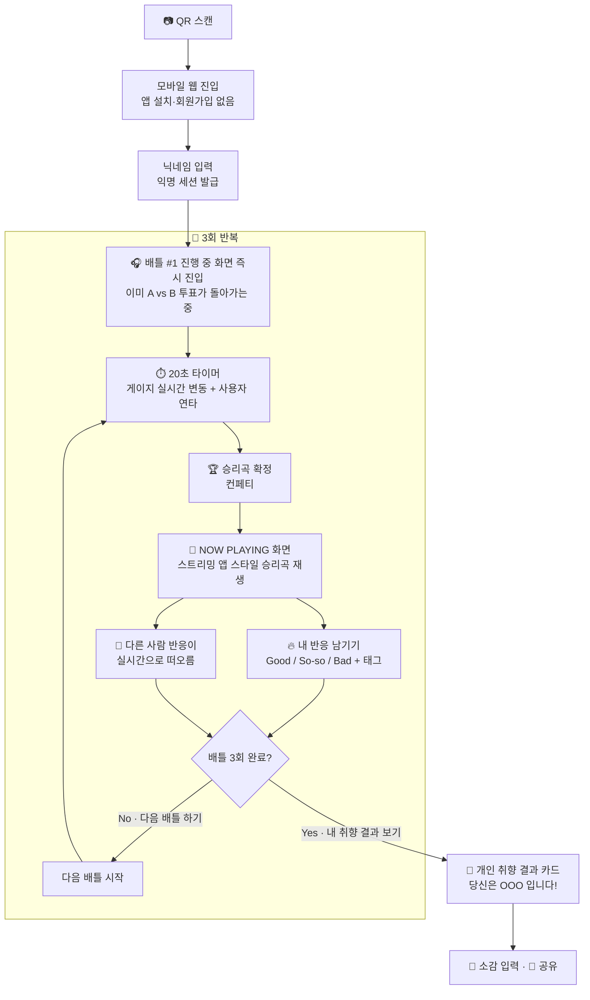
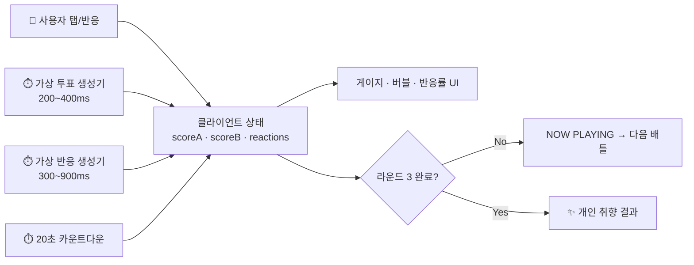
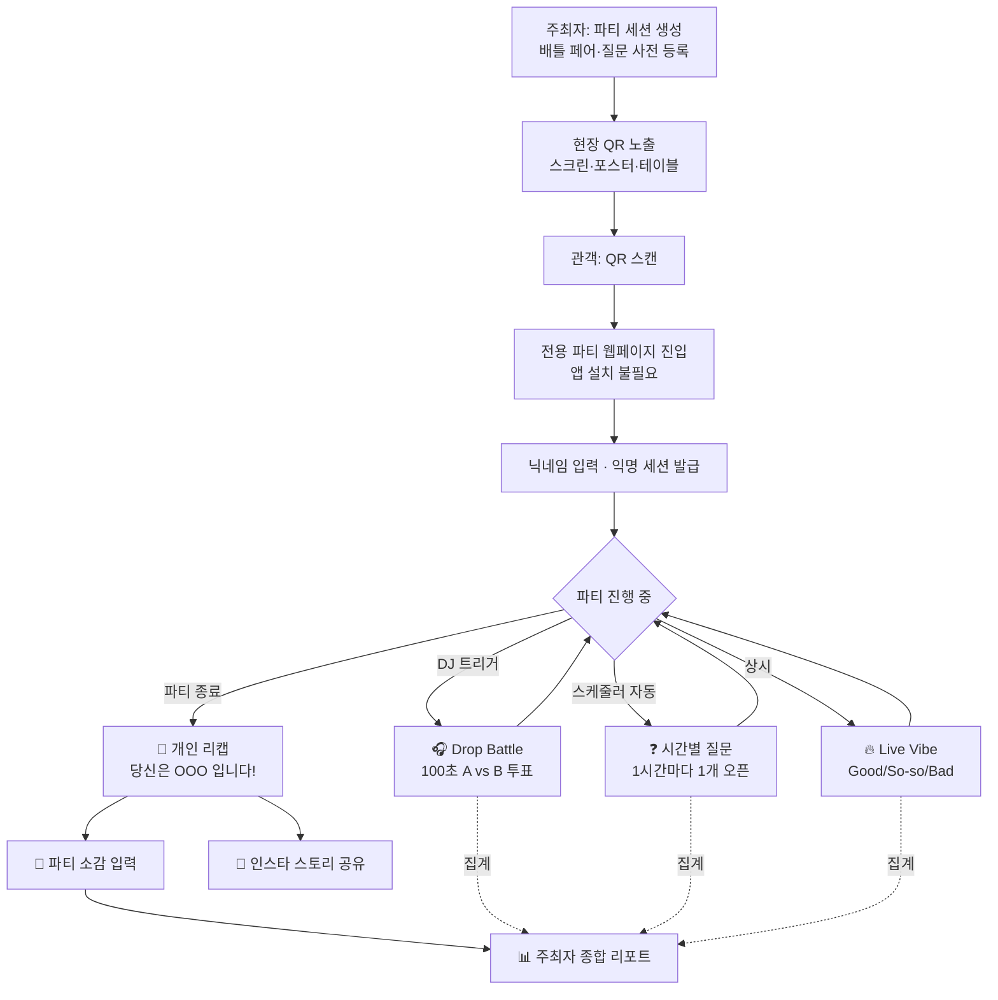
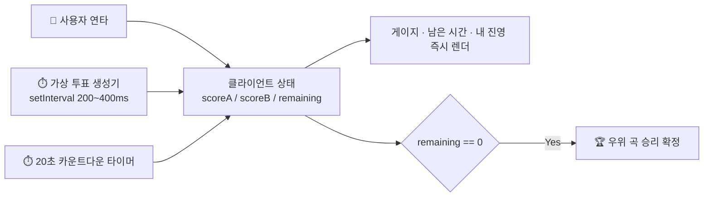
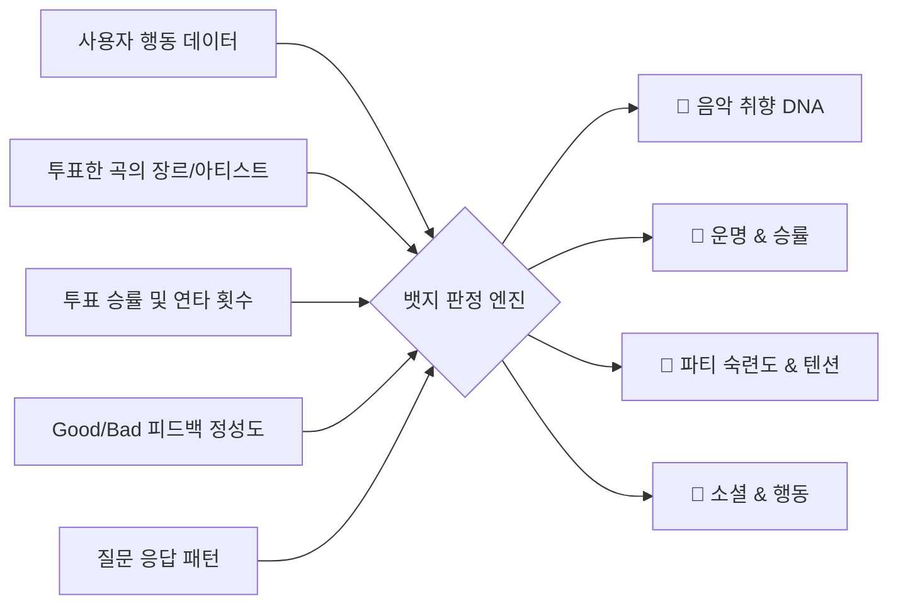
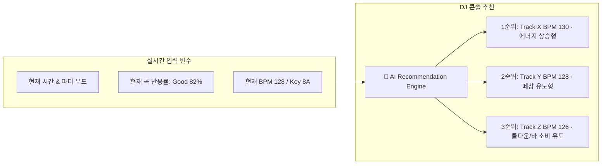
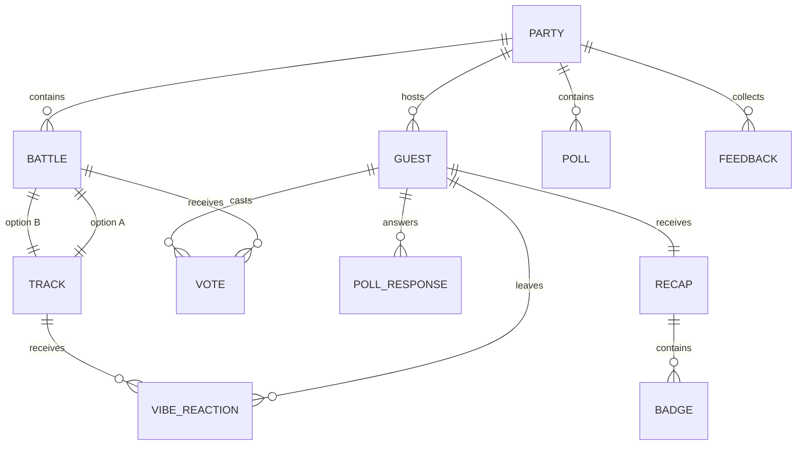
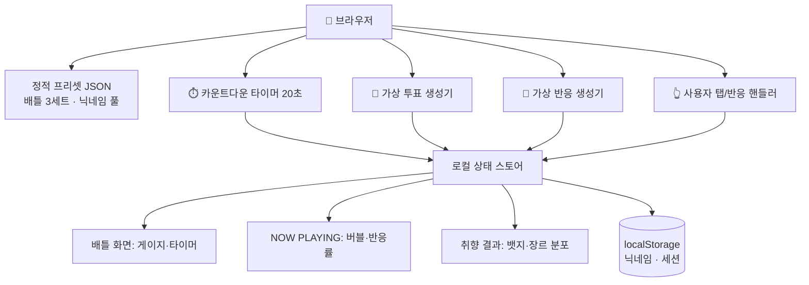
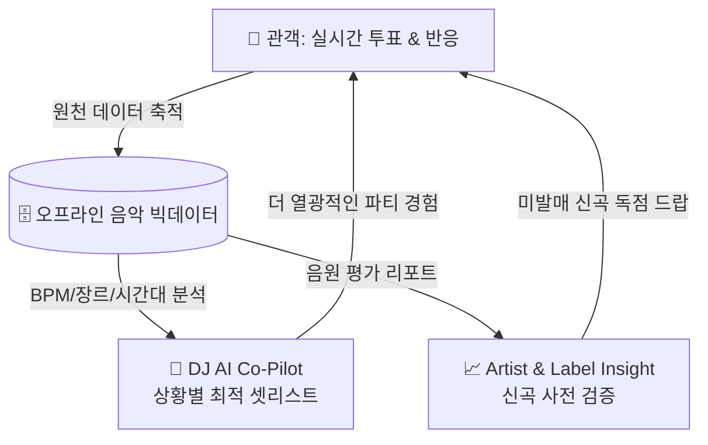

# PartySync PRD — 단일 진실 공급원 (Single Source of Truth)

**실시간 참여형 파티 인터랙션 플랫폼**

| 항목 | 내용 |
| :--- | :--- |
| 문서 버전 | **v2.1 (SSOT)** |
| 최종 수정일 | 2026-08-29 |
| 상태 | 개발 착수 확정 |
| 제품명(가칭) | PartySync |
| 대상 릴리즈 | **Phase 0 — 1인 데모(Demo Build)** |
| 문서 소유자 | Product Owner |

> **이 문서의 지위**  
> 이 PRD는 이전에 작성된 3개의 기획 문서(Drop Battle 기능안 / Persona·Badge 시스템안 / Data Ecosystem·BM 구조안)를 통합·정리한 **단일 진실 공급원**입니다.  
> 이전 문서와 본 문서의 내용이 충돌할 경우 **본 문서가 우선**합니다. 변경된 결정 사항은 §14 의사결정 기록에 명시했습니다.

> **v1.0 → v2.0 변경 요약**  
> 이번 개발은 실제 파티 운영이 아닌 **사용자 1명이 혼자 체험하는 데모**를 만드는 것을 목표로 합니다.  
> 이에 따라 **§0 데모 시나리오** 섹션을 신설하고, 이와 충돌하는 실시간 통신·배틀 길이·동시성 관련 사양을 수정했습니다.  
> 그 외 제품 비전·페르소나·뱃지·리캡·BM 등은 v1.0 내용을 그대로 유지합니다.

> **v2.0 → v2.1 변경 요약** ⭐  
> 데모의 세션 구조를 **배틀 1회 → 배틀 3회 반복 루프**로 전면 개정했습니다.  
> ① 배틀 종료 후 승리곡을 **스트리밍 앱 스타일 NOW PLAYING 화면**으로 보여주고,  
> ② 그 화면에서 **내 반응(Good/So-so/Bad)을 남기고 다른 사람 반응이 실시간으로 떠오르는** UX를 신설했으며(§0.4),  
> ③ `[다음 배틀 하기]` 버튼으로 **총 3라운드를 반복**한 뒤 **개인 취향 결과**로 종료하도록 흐름을 바꿨습니다(§0.3).  
> 이에 따라 v2.0에서 범위 제외였던 **F4 Live Vibe Tracker가 범위로 복귀**했고, 뱃지 판정 규칙이 3라운드 누적 기준으로 개정됐습니다(§0.10).

---

## 0. 이번 개발 범위 — 1인 데모 시나리오 ⭐ **v2.1 전면 개정**

> **이 섹션은 구속력 있는 개발 사양(Binding Spec)입니다.**  
> §1 이후의 내용은 제품의 최종 지향점이며, **실제로 이번에 구현하는 범위는 본 섹션이 정의하는 것뿐**입니다.  
> §1~§16의 서술과 본 섹션이 충돌하면 **항상 §0이 우선**합니다.

### 0.1 전제 조건

| 항목 | 데모 전제 |
| :--- | :--- |
| **실제 사용자 수** | **동시 접속 1명** (시연자 본인). 다수 관객 환경은 전제하지 않는다 |
| **다른 참가자** | 실존하지 않는다. **클라이언트에서 시뮬레이션된 가상 투표·가상 반응**으로 표현한다 |
| **첫 배틀 상태** | 사용자가 QR로 진입하는 순간, **이미 1번째 배틀이 진행 중인 것처럼** 보여야 한다 |
| **세션 구조** | **배틀 → 승리곡 NOW PLAYING 화면 → 다음 배틀** 을 **총 3회 반복**한 뒤 개인 취향 결과로 종료 |
| **배틀 길이** | **1회당 20초** (v1.0의 100초에서 단축) |
| **승패 판정** | 20초 종료 시점의 게이지 우위로 확정. 가상 투표가 랜덤이므로 **결과도 랜덤** |
| **DJ 콘솔 / 메인 스크린** | 이번 범위 **제외**. 배틀 시작 트리거는 사용자 진입/버튼이 대신한다 |
| **서버 실시간 통신** | **불필요**. WebSocket·Socket.io·SSE 모두 구현하지 않는다 (§0.5) |
| **총 소요 시간** | **약 2분** (배틀 20초 × 3 + 결과 화면 체류 + 리캡) |

### 0.2 데모 골든 패스 (Golden Path)



**핵심 체감 포인트 3가지**

1. **합류감** — "이미 달아오른 투표에 늦게 끼어들어 마지막 20초를 뒤집는다." 빈 화면에서 시작하는 느낌을 주면 실패다.
2. **보상감** — 내가 고른 곡이 실제로 "재생되는" 화면을 본다. 투표가 결과로 이어졌다는 증거.
3. **동석감** — 그 곡을 나 혼자 듣는 게 아니라, 다른 사람들의 반응이 실시간으로 떠오른다. 플로어에 함께 있는 느낌.

### 0.3 세션 타임라인 (총 3라운드)

```
[진입]  ── 닉네임 입력 직후, 배틀 #1은 "이미 진행 중" 상태로 렌더링
   │        → 시드 득표(300~600표)가 이미 쌓인 팽팽한 게이지
   │
┌─ ROUND 1 ─────────────────────────────────────────────────┐
│ [00:00~00:20] 20초 연타 배틀 (가상 투표 유입 + 사용자 연타)  │
│ [00:15~00:20] 마지막 5초 카운트다운 강조                     │
│ [00:20]       승리곡 확정 → 컨페티                          │
│ [00:21~]      🎵 NOW PLAYING 화면 (체류 시간 제한 없음)      │
│               · 승리곡 스트리밍 앱 스타일 재생 뷰            │
│               · 내 반응 입력 + 다른 사람 반응 실시간 유입     │
│               · [다음 배틀 하기 ▶] CTA                      │
└───────────────────────────────────────────────────────────┘
┌─ ROUND 2 ── 동일 구조. 단, 배틀은 [다음 배틀 하기] 탭 시점부터 시작 ─┐
│ ※ 2라운드부터는 "이미 진행 중" 연출 대신 3초 프리롤 후 카운트다운   │
└───────────────────────────────────────────────────────────┘
┌─ ROUND 3 ── 동일 구조. NOW PLAYING 화면의 CTA만 변경 ──────────┐
│ [내 취향 결과 보기 ✨] → 개인 리캡(취향 결과) 카드로 전환        │
└───────────────────────────────────────────────────────────┘
```

| 라운드 | 배틀 시작 방식 | NOW PLAYING CTA |
| :---: | :--- | :--- |
| **1** | 진입 즉시, **이미 진행 중** (시드 득표 상태) | `다음 배틀 하기 ▶` |
| **2** | 버튼 탭 → **3초 프리롤**(후보곡 소개) → 20초 카운트다운 | `다음 배틀 하기 ▶` |
| **3** | 버튼 탭 → **3초 프리롤** → 20초 카운트다운 | `내 취향 결과 보기 ✨` |

> **라운드 수는 `ROUND_TOTAL` 상수로 관리**한다. 기본값 3, 시연 상황에 따라 2로 낮출 수 있어야 한다.  
> 2라운드부터 시드 득표를 다시 넣을지 여부: **넣는다.** 사용자가 버튼을 누른 뒤에도 "이미 다른 사람들이 투표 중인 판"이라는 감각을 유지해야 하므로, 프리롤 3초 동안 게이지가 0이 아닌 시드값에서 요동하기 시작한다.

### 0.4 🎵 NOW PLAYING 화면 — 승리곡 & 반응 UX ⭐ **v2.1 신설 핵심**

배틀에서 이긴 곡이 **실제로 플로어에 걸린 것처럼** 보여주는 화면. 스트리밍 앱의 재생 화면 문법을 그대로 차용해, 투표 결과가 실체를 갖게 한다.

#### 0.4.1 화면 구성

```text
┌──────────────────────────────────────────────┐
│  🏆 WINNER · ROUND 1/3                       │
│                                              │
│        ┌────────────────────┐                │
│        │                    │                │
│        │    앨범 아트워크     │   ← 은은한 펄스 │
│        │   (정사각 대형)      │      + 글로우   │
│        │                    │                │
│        └────────────────────┘                │
│                                              │
│   Track Title                                │
│   Artist Name                          ♡     │
│                                              │
│   ▶ ━━━━━●────────────────  1:12 / 3:48      │
│   ‖‖▁▃▅▇▅▃▁‖‖  (오디오 비주얼라이저)          │
│                                              │
│   📊 1,247 vs 1,102  ·  53% 로 승리           │
│   🙌 내가 고른 곡이 이겼어요!                   │
│                                              │
│  ─────────────────────────────────────────   │
│   "지금 이 노래 어때요?"                        │
│   [ 🔥 미쳤다 ]  [ 😐 쏘쏘 ]  [ 🥱 루즈해요 ]    │
│                                              │
│   🏷️ #비트가_신나요 #떼창각 #드랍이_약함        │
│                                              │
│   🔥 82%  😐 14%  🥱 4%   · 방금 87명 반응     │
│                                              │
│         [ 다음 배틀 하기 ▶ ]                   │
└──────────────────────────────────────────────┘
        ↑ 화면 우측 하단에서 이모지 버블이
          계속 떠올랐다 사라짐 (다른 사람 반응)
```

#### 0.4.2 요구사항

| ID | 요구사항 | 우선순위 |
| :--- | :--- | :---: |
| **N-1** | 배틀 종료 즉시 승리곡의 NOW PLAYING 화면으로 전환한다 (컨페티 → 크로스페이드) | **P0** |
| **N-2** | 앨범 아트워크, 곡명, 아티스트를 스트리밍 앱 재생 화면 문법으로 크게 표시한다 | **P0** |
| **N-3** | **가짜 재생 진행바**가 자동으로 흐른다 (실제 음원 재생 없음 — §10 저작권 참조) | **P0** |
| **N-4** | 최종 득표수와 득표율, 그리고 **내 선택의 승패**를 명시한다 (`내가 고른 곡이 이겼어요!` / `아쉽게 졌어요`) | **P0** |
| **N-5** | 사용자는 `🔥 미쳤다 / 😐 쏘쏘 / 🥱 루즈해요` 중 1개를 **1탭**으로 남길 수 있다 | **P0** |
| **N-6** | 반응 선택 후 세부 태그를 **최대 3개**까지 선택할 수 있다 (선택 사항) | **P1** |
| **N-7** | 곡당 1인 1회 반응. 재선택 시 기존 반응을 덮어쓴다 | **P0** |
| **N-8** | **다른 사람들의 반응이 실시간으로 유입되는 것처럼 표현**한다 (§0.4.3) | **P0** |
| **N-9** | 화면 상단/하단에 **누적 반응률 바**(`🔥 82% / 😐 14% / 🥱 4%`)를 표시하고, 반응 유입에 따라 실시간 갱신한다 | **P0** |
| **N-10** | `[다음 배틀 하기 ▶]` 버튼은 항상 노출되며, 진입 후 **8초가 지나면 펄스 애니메이션**으로 다음 행동을 유도한다 | **P0** |
| **N-11** | 마지막 라운드에서는 버튼 라벨이 `[내 취향 결과 보기 ✨]`로 바뀐다 | **P0** |
| **N-12** | 화면 상단에 `ROUND 1/3` 진행 표시를 둬서 앞으로 몇 판 남았는지 인지시킨다 | **P1** |
| **N-13** | 사용자가 반응을 남기지 않아도 다음 배틀로 진행할 수 있다 (반응은 강제하지 않음) | **P0** |
| **N-14** | 반응 입력 시 햅틱 피드백과 함께 **내 이모지 버블을 더 크게·중앙에** 띄운다 | **P1** |
| **N-15** | 좋아요(♡)로 곡을 저장할 수 있다 (취향 결과에 가중치로 반영) | **P2** |

#### 0.4.3 다른 사람 반응 UI — 시뮬레이션 사양

실존하지 않는 관객의 반응을 **인스타그램 라이브의 하트 애니메이션** 문법으로 표현한다.

| 요소 | 사양 |
| :--- | :--- |
| **이모지 버블** | 화면 하단에서 위로 떠오르며 페이드아웃. 300~900ms 랜덤 간격으로 1~3개씩 생성. 좌우 흔들림(sine) + 랜덤 크기(24~40px) |
| **버블 이모지 분포** | 승리곡 반응이므로 긍정 편향: `🔥 70% / 😐 22% / 🥱 8%` (곡별 `basePositivity` 값으로 조정) |
| **닉네임 토스트** | 2~4초마다 `Yuna_92 님이 🔥 남겼어요` 형태로 하단에 1줄씩 스쳐 지나감. 가상 닉네임 풀(30개 이상) 사용 |
| **태그 티커** | 다른 사람이 고른 세부 태그가 흘러감 (`#드랍이미쳤다 #떼창각 #베이스터짐`) |
| **누적 반응률 바** | 유입에 따라 부드럽게(ease) 증가. 급격한 점프 금지 |
| **반응 인원 카운터** | `방금 87명 반응` — 시간에 따라 완만히 증가 |
| **유입 감쇠** | 화면 진입 직후 가장 활발하고(초당 3~4개), 15초 이후 초당 1개 수준으로 자연스럽게 감소 → 체류가 길어져도 어색하지 않게 |
| **내 반응 강조** | 사용자가 남긴 반응은 버블 크기 1.6배 + 짧은 스케일 팝 + 햅틱. "내 반응이 저 안에 섞였다"는 체감 |

> **연출 원칙**: 버블은 **터치를 방해하지 않는 레이어**(pointer-events: none)에 그린다. 반응 버튼과 CTA 버튼 위를 가리지 않도록 안전 영역을 확보한다.

### 0.5 실시간성 구현 방식 — **WebSocket 미구현**

이 데모의 "실시간"은 서버 동기화가 아니라 **클라이언트 로컬 시뮬레이션**으로 만든다.

| 구분 | v1.0 정식 사양 | **v2.1 데모 구현** |
| :--- | :--- | :--- |
| 통신 방식 | WebSocket 3-Way 브로드캐스트 | **없음.** 클라이언트 내 타이머 루프(`setInterval`)만 사용 |
| 타 참가자 투표 | 실제 사용자들의 탭 집계 | **의사난수 기반 가상 투표 생성기** |
| 타 참가자 반응 | 실제 Good/So-so/Bad 집계 | **의사난수 기반 가상 반응 생성기** (§0.4.3) |
| 상태 저장 | Redis + Kafka + PostgreSQL | **클라이언트 인메모리 상태** (+ 세션 복원용 `localStorage`) |
| 서버 역할 | 실시간 집계·브로드캐스트 | **정적 페이지 서빙 + 배틀 프리셋 JSON 제공** 정도 |



**금지 사항**: 이번 범위에서 Socket.io / WebPubSub / Kafka / Redis / TimescaleDB를 도입하지 않는다.

### 0.6 시뮬레이션 & 판정 로직

```
CONST ROUND_TOTAL     = 3      // 총 배틀 횟수 (2로 조정 가능)
CONST BATTLE_DURATION = 20     // 초
CONST TAP_LIMIT       = 100    // 배틀 1회당 사용자 탭 상한

// ─── 1) 배틀 시작 (라운드 공통) ───────────────────────────
startBattle(round):
    pair = PRESETS[round]                  // 정적 JSON, 라운드별 다른 장르 구도
    totalSeed = random(300, 600)           // 이미 쌓여 있는 누적 득표
    ratioSeed = random(0.45, 0.55)         // 팽팽한 초반 구도
    scoreA = round(totalSeed * ratioSeed)
    scoreB = totalSeed - scoreA
    myTeam = null; myTapCount = 0
    remaining = BATTLE_DURATION
    if round > 1: preroll(3)               // 2라운드부터 3초 프리롤

// ─── 2) 가상 투표 유입 (200~400ms 랜덤 간격) ──────────────
onVoteTick():
    delta = random(1, 15)
    if random() < 0.5: scoreA += delta
    else:              scoreB += delta
    render(gauge = clamp(scoreA / (scoreA + scoreB), 0.15, 0.85))

// ─── 3) 사용자 연타 (낙관적 UI, 즉시 반영) ────────────────
onUserTap(side):
    if myTeam == null: myTeam = side       // 첫 탭으로 진영 확정, 변경 불가
    if myTapCount < TAP_LIMIT:
        score[myTeam] += random(1, 3)
        myTapCount += 1; vibrate(10)

// ─── 4) 20초 종료 → 승패 확정 ─────────────────────────────
onTimeout():
    if   scoreA > scoreB: winner = A
    elif scoreB > scoreA: winner = B
    else:                 winner = randomPick(A, B)      // 동점 → 랜덤
    log.push({ round, winner, myTeam, myTapCount,
               didIWin: winner == myTeam })
    goToNowPlaying(winner)

// ─── 5) NOW PLAYING — 가상 반응 유입 ──────────────────────
onEnterNowPlaying(track):
    reactions = { good: seed(60,120), soso: seed(10,30), bad: seed(2,12) }
    startReactionLoop()

onReactionTick():                          // 300~900ms 랜덤 간격
    r = weightedPick(good: 0.70, soso: 0.22, bad: 0.08)
    reactions[r] += 1
    spawnBubble(emoji[r])                  // 하단 → 상단 부유 애니메이션
    if random() < 0.25: showNicknameToast(randomNickname(), r)
    decayRate()                            // 15초 이후 유입 속도 완만히 감소

onUserReaction(r):
    myReaction[round] = r                  // 곡당 1회, 재선택 시 덮어쓰기
    reactions[r] += 1
    spawnBubble(emoji[r], scale: 1.6); vibrate(15)

// ─── 6) 다음 배틀 / 종료 분기 ─────────────────────────────
onNextButton():
    if round < ROUND_TOTAL: startBattle(round + 1)
    else:                   goToRecap(log, myReaction)
```

| 파라미터 | 데모 기본값 | 비고 |
| :--- | :--- | :--- |
| `ROUND_TOTAL` | **3** | 총 배틀 횟수. 2로 축소 가능 |
| `BATTLE_DURATION` | 20초 | 라운드당 타이머 길이 |
| `PREROLL` | 3초 | 2라운드부터의 후보곡 소개 구간 |
| `TICK_INTERVAL` | 200~400ms 랜덤 | 일정 간격이면 기계적으로 보임 |
| `DELTA_PER_TICK` | 1~15표 | 게이지가 눈에 띄게 요동칠 정도 |
| `SEED_TOTAL` | 300~600표 | 진입 시 이미 쌓인 표 |
| `SEED_RATIO` | 45~55% | 초반부터 박빙 구도 |
| `GAUGE_CLAMP` | 15~85% | 화면상 일방적 구도 방지 |
| `TAP_LIMIT` | 배틀당 100탭 | 20초 기준 |
| `TAP_WEIGHT` | 탭당 1~3표 | 사용자 개입 체감 확보 |
| `REACTION_INTERVAL` | 300~900ms 랜덤 | 가상 반응 버블 생성 간격 |
| `REACTION_BIAS` | 🔥70 / 😐22 / 🥱8 | 승리곡이므로 긍정 편향 |
| `NICKNAME_POOL` | 30개 이상 | 토스트용 가상 닉네임 |

> ⚠️ **밸런스 원칙**: 가상 투표가 사용자 연타를 압도해서는 안 된다. 20초 내내 연타하면 **라운드당 승률 60~70%** 가 되도록 튜닝한다. 3라운드 기준으로 **전승·전패가 모두 나올 수 있어야** 취향 결과의 서사가 다양해진다.

### 0.7 배틀 프리셋 설계 (정적 JSON)

라운드마다 **장르 구도를 다르게** 배치해야, 3라운드 후 취향 결과가 의미 있게 나온다.

| 라운드 | 테마 태그 | A 후보 | B 후보 |
| :---: | :--- | :--- | :--- |
| 1 | 장르 대결 | `하우스 🏠` | `테크노 ⚡` |
| 2 | 시대 대결 | `2000년대 추억가요 📼` | `최신 챌린지송 📱` |
| 3 | 분위기 대결 | `감성 싱어롱 🎙️` | `광란의 헤드뱅잉 🤯` |

각 트랙은 `title` / `artist` / `artwork_url` / `genre_tags`(필수) / `basePositivity`(반응 편향값)를 갖는다.

### 0.8 이번 범위에서 제외하는 것

| 제외 항목 | 사유 / 대체 방식 |
| :--- | :--- |
| WebSocket 실시간 서버 | §0.5 — 클라이언트 시뮬레이션으로 대체 |
| DJ 콘솔 (F8) · 메인 스크린 뷰 | 1인 데모에 관찰자가 없음. 배틀은 자동/버튼으로 시작 |
| 주최자 세션 생성 UI (F1-1) | 배틀 프리셋을 하드코딩된 JSON으로 대체 |
| 시간별 질문 (F3) | 2분 세션 안에 시간당 1개 오픈 방식이 성립하지 않음 |
| 실제 음원 재생 | NOW PLAYING은 **가짜 진행바 + 비주얼라이저**만. 저작권 이슈 회피 (§10) |
| 주최자 종합 리포트 (F7.1) | 집계할 실데이터가 없음 |
| 서버 DB 영속화 (§7) | 스키마는 설계 참고용으로 유지, 데모는 클라이언트 상태만 사용 |
| 매크로 탐지 · 부정행위 방지 | 사용자가 1명이므로 무의미. 탭 상한만 유지 |

### 0.9 유지하는 것 (데모에서도 반드시 구현)

- **F1 QR 온보딩** — QR 스캔 → 닉네임 입력 → 즉시 배틀 진입 (앱 설치·회원가입 없음)
- **F2 Drop Battle 코어 UX** — A vs B 스플릿 카드, 연타 부스트, 실시간 게이지, 진영 확정, 컨페티 (**3라운드 반복**)
- **F4 Live Vibe 반응** — NOW PLAYING 화면에서 Good/So-so/Bad + 세부 태그 (**v2.0에서 제외였으나 v2.1에서 범위 복귀**)
- **F5 개인 취향 결과(리캡)** — 3라운드 누적 데이터로 뱃지 판정 후 9:16 공유 카드 발행
- **F6 뱃지 판정** — §0.10 데모 규칙 적용
- **F7 소감 입력** — 별점 + 자유 텍스트 (수집만 하고 리포트는 미구현)

### 0.10 데모용 취향 결과 판정 규칙 ⭐ **v2.1 개정**

3라운드 배틀(투표 3회 + 반응 3회) 데이터를 기반으로 판정한다. v2.0의 1회차 축약 규칙을 대체한다.

**입력 데이터**
- 라운드별: 내가 고른 곡 / 승패 / 탭 수 / 남긴 반응(Good·So-so·Bad) / 선택한 세부 태그
- 파생값: 총 승수(0~3), 총 탭 수, 반응 참여 횟수, **내가 고른 곡 + Good 반응한 곡의 `genre_tags` 분포**

**① 대표 뱃지 — 승률 (Category 2)**

| 조건 | 뱃지 |
| :--- | :--- |
| 3승 0패 | `🔮 DJ 텔레파시` |
| 2승 1패 | `🎧 굿 리스너` |
| 1승 2패 | `⚖️ 승부의 신 (캐스팅보터)` |
| 0승 3패 | `🥀 고독한 마이너 취향` |

**② 보조 뱃지 1 — 음악 취향 (Category 1)**

`genre_tags` 최빈 장르 비중이 **60% 이상**이면 해당 장르 뱃지(`🐰 K-POP 씹어먹은 덕후`, `⚡ 150 BPM 테크노 폭주기관차`, `📼 2000s 추억의 감성러` 등), 미달이면 `🎨 잡식성 옴니보어`.

**③ 보조 뱃지 2 — 텐션 & 참여도 (Category 3)**

| 조건 | 뱃지 |
| :--- | :--- |
| 3라운드 모두 반응 + 세부 태그 1회 이상 | `🎧 프로 굿 리스너 (A&R 꿈나무)` |
| 배틀당 평균 60탭 이상 | `🔥 연타 머신 (지문 실종)` |
| 위 조건 미달 | 보조 뱃지 2 미부여 |

**④ 폴백**: 3라운드 내내 탭 0회 + 반응 0회 → `🐣 뚝딱거리는 파티 뉴비` 단독 부여

> 대표 1 + 보조 최대 2, 총 3개 규칙(D-04)은 그대로 유지한다.

**취향 결과 카드 추가 구성** (v2.1)
- **내 장르 분포 도넛 차트** — 3라운드 동안 내가 지지한 곡의 장르 비중
- **내 최애 드랍** — 내가 `🔥 미쳤다`를 남긴 곡 중 득표율이 가장 높았던 곡
- **라운드별 승패 스트립** — `✅ ❌ ✅` 형태로 3판 요약
- **총 탭 수 / 남긴 반응 수**

### 0.11 데모 완료 기준 (Definition of Done)

- [ ] QR 스캔 → 배틀 #1 진입까지 **3초 이내**, 진입 즉시 게이지가 움직이고 있다
- [ ] 20초 타이머가 3라운드 모두 정확히 동작하고, 매번 승리곡이 예외 없이 확정된다
- [ ] 사용자 연타가 게이지에 **지연 없이(체감 0ms)** 반영된다
- [ ] 배틀 종료 → NOW PLAYING 전환이 끊김 없이 이어지고, 승리곡 정보가 정확히 표시된다
- [ ] NOW PLAYING 화면에서 **다른 사람 반응 버블이 계속 떠오르며**, 내 반응은 시각적으로 구분된다
- [ ] `[다음 배틀 하기]` → 다음 라운드가 새 프리셋·새 시드로 정상 시작된다
- [ ] 3라운드 종료 후 CTA가 `[내 취향 결과 보기]`로 바뀌고 취향 결과 카드로 전환된다
- [ ] 취향 결과가 **실제 3라운드 행동 데이터를 반영**한다 (전승/전패/혼합 케이스 모두 검증)
- [ ] 10회 반복 시연에서 승/패 조합이 다양하게 발생한다 (한쪽으로 고정되지 않음)
- [ ] 전체 플로우 소요 시간이 **2분 내외**로 유지된다

---

## 1. 배경 및 문제 정의

### 1.1 배경
DJ가 있는 페스티벌·클럽·하우스 파티는 본질적으로 "음악을 함께 듣는 경험"이지만, 현재 관객은 **일방적인 수신자**에 머문다. 선곡은 전적으로 DJ가 결정하고, 관객은 그 결과를 소비할 뿐이다. 파티가 끝나면 그날의 경험은 개인의 기억과 흐릿한 사진 몇 장으로만 남는다.

### 1.2 문제 정의

| 이해관계자 | 현재 겪는 문제 |
| :--- | :--- |
| **관객** | 참여할 방법이 없다. 취향에 맞지 않는 곡이 나와도 의사표현 수단이 없고, 파티가 끝나면 남는 것이 없다. |
| **DJ** | 관객 반응을 "체감"에만 의존한다. 플로어가 식어가는 이유를 모르고, 다음 곡 선택이 감에 의존한다. |
| **파티 주최자/기획자** | 행사 후 관객 만족도를 정량적으로 알 수 없다. 피드백은 SNS 멘션 몇 개가 전부다. |
| **아티스트/레이블** | 신곡이 실제 플로어에서 어떻게 먹히는지 발매 전에 검증할 방법이 없다. |

### 1.3 해결 가설
> 관객에게 **"내 선택이 다음 곡을 바꾼다"**는 실질적 통제권을 주면, 관객은 자발적으로 참여하고, 그 참여 데이터는 DJ·주최자·아티스트 모두에게 지금까지 존재하지 않았던 **오프라인 음악 반응 데이터**가 된다.

---

## 2. 제품 목표 및 성공 지표

### 2.1 North Star Metric
**파티 1회당 활성 참여율 (Active Participation Rate)**  
= (1회 이상 투표/반응한 참가자 수) ÷ (현장 추정 인원)  
→ **MVP 목표: 40% 이상**

### 2.2 단계별 KPI

| 구분 | 지표 | MVP 목표 |
| :--- | :--- | :--- |
| **획득** | QR 스캔 → 세션 진입 전환율 | 70% 이상 |
| **참여** | 배틀 1회당 평균 투표 참여자 수 | 활성 사용자의 60% 이상 |
| **참여** | 참가자 1인당 평균 배틀 참여 횟수 | 3회 이상 |
| **리텐션** | 파티 종료 후 리캡(영수증) 열람률 | 50% 이상 |
| **바이럴** | 리캡 카드 SNS 공유율 | 15% 이상 |
| **피드백** | 파티 소감 작성률 | 20% 이상 |
| **B2B** | 주최자 리포트 열람률 | 90% 이상 |

> **v2 데모 적용 범위**: 위 KPI는 다수 관객을 전제한 지표이므로 **Phase 0 데모에서는 측정하지 않는다.** 데모의 성공 기준은 §0.11로 대체한다.

### 2.3 명시적 비목표 (Non-goals)
- 음원 스트리밍·재생 기능 제공 (실제 재생은 DJ 장비가 담당)
- 티켓 판매·예매 플랫폼
- 상시 소셜 네트워크 (파티 세션 종료 후 지속되는 커뮤니티)
- MVP 단계에서의 앱 스토어 네이티브 앱 (웹 우선)

---

## 3. 사용자 정의

### 3.1 페르소나

**P1. 관객 (Guest) — 핵심 사용자**
- 20~30대, 클럽/페스티벌 방문객. 술 한 잔 들고 한 손으로 폰을 조작.
- 조명이 어둡고 소음이 크며, 집중 시간은 **5초 이내**.
- 니즈: 심심할 때의 놀거리, 내 취향 인정받기, 인스타에 올릴 거리.

**P2. DJ / 퍼포머**
- 부스에서 믹싱 중. 양손이 바쁘고, 조작은 **원터치**여야 한다.
- 니즈: 플로어 반응 확인, 선곡 리스크 감소, 관객과의 상호작용 연출.

**P3. 파티 주최자 / 기획자 (Host)**
- 행사 준비·운영 총괄. 사전 세팅에 시간을 쓸 수 있는 유일한 역할.
- 니즈: 관객 만족도 증빙, 다음 행사 개선점, 스폰서 리포팅.

**P4. 아티스트 / 레이블 (Phase 3)**
- 니즈: 발매 전 신곡의 현장 반응 검증.

> **v2 데모**: 이번 개발에서 실제로 구현하는 역할은 **P1 관객(Guest) 하나뿐**이다. DJ·주최자·아티스트 화면은 구현하지 않으며, 이들의 조작(배틀 시작·페어 등록)은 하드코딩된 프리셋과 자동 시작으로 대체한다.

### 3.2 사용자 권한 매트릭스

| 기능 | 관객 | DJ | 주최자 | 아티스트 |
| :--- | :---: | :---: | :---: | :---: |
| 파티 세션 생성 / QR 발급 | ✗ | ✗ | ✓ | ✗ |
| 배틀 페어·질문 사전 등록 | ✗ | ✓ | ✓ | ✗ |
| 배틀 시작 / 종료 트리거 | ✗ | ✓ | ✓ | ✗ |
| 투표 및 반응 | ✓ | ✗ | ✗ | ✗ |
| 소감 작성 | ✓ | ✗ | ✗ | ✗ |
| 개인 리캡 열람 | ✓(본인) | ✗ | ✗ | ✗ |
| 파티 종합 리포트 열람 | ✗ | ✓ | ✓ | ✗ |
| 트랙 반응 리포트 열람 | ✗ | ✗ | ✗ | ✓ |

---

## 4. 핵심 사용자 여정 (End-to-End Flow)

> **v2 데모**: 아래는 정식 릴리즈의 전체 여정(수 시간짜리 파티)이다. **이번에 구현하는 여정은 §0.2 골든 패스** — QR → 닉네임 → (진행 중인 20초 배틀 → 승리곡 NOW PLAYING + 반응) **× 3라운드** → 개인 취향 결과 → 소감 — 이며, 소요 시간은 총 2분 내외다.



### 4.1 관객 시간축 시나리오 (예: 22:00~03:00 파티)

| 시각 | 이벤트 | 관객 행동 |
| :--- | :--- | :--- |
| 22:10 | 입장 | 테이블 QR 스캔 → 닉네임 `DJ_Lover_99` 입력 |
| 22:30 | 질문 #1 오픈 | "오늘 밤 당신의 목표는?" 선택지 응답 |
| 23:15 | Drop Battle #1 | 100초간 A vs B 연타 투표 → 내가 고른 곡 승리 🎉 |
| 23:40 | Live Vibe | 재생 중인 곡에 `🔥 미쳤다` 탭 |
| 00:30 | 질문 #2 오픈 | 응답 |
| 01:00~ | Drop Battle #2~#5 | 반복 참여 |
| 02:50 | 파티 종료 | 자동 푸시 → **개인 리캡 카드** 도착 |
| 02:55 | 리캡 확인 | "당신은 **🥀 고독한 마이너 취향**!" → 스토리 공유 |
| 02:58 | 소감 입력 | "음악은 최고였는데 화장실 줄이 너무 길었어요" |

### 4.2 v2 데모 시간축 시나리오 (총 약 2분) ⭐

| 경과 | 이벤트 | 사용자 행동 / 화면 |
| :--- | :--- | :--- |
| 00:00 | QR 스캔 | 모바일 웹 진입 (앱 설치·회원가입 없음) |
| 00:03 | 닉네임 입력 | `DJ_Lover_99` 입력 → [입장] |
| 00:05 | **배틀 #1 진입** | **이미 진행 중**. `하우스 🏠 vs 테크노 ⚡`, 게이지 47:53, 참여 인원 87명 |
| 00:05~00:25 | 20초 연타 | B(테크노) 첫 탭으로 진영 확정 → 연타. 마지막 5초 카운트다운 강조 |
| 00:25 | 승리곡 확정 | 테크노 트랙 WIN → 컨페티 |
| 00:26 | **🎵 NOW PLAYING #1** | 앨범아트 + 가짜 재생바 + `1,247 vs 1,102 · 53% 로 승리` |
| 00:30 | 반응 남기기 | `🔥 미쳤다` 탭 + `#드랍이_미쳤다` 태그. 내 버블이 크게 떠오름 |
| 00:26~00:40 | 다른 사람 반응 | 이모지 버블 계속 유입, `Yuna_92 님이 🔥 남겼어요` 토스트, 반응률 `🔥 82%` |
| 00:40 | `다음 배틀 하기 ▶` | 3초 프리롤 → 배틀 #2 (`2000년대 📼 vs 최신 챌린지송 📱`) |
| 00:43~01:03 | 배틀 #2 | 연타 → 이번엔 패배 |
| 01:04~01:15 | NOW PLAYING #2 | `아쉽게 졌어요` 표시. 그래도 반응은 남길 수 있음 |
| 01:15~01:38 | 배틀 #3 | `감성 싱어롱 🎙️ vs 광란의 헤드뱅잉 🤯` → 승리 |
| 01:39~01:50 | NOW PLAYING #3 | CTA가 `내 취향 결과 보기 ✨` 로 변경 |
| 01:52 | **개인 취향 결과** | "당신은 **🎧 굿 리스너**!" (2승 1패) + 장르 분포 도넛 + 최애 드랍 |
| 02:05 | 공유 / 소감 | 9:16 카드 저장 또는 소감 입력 |

---

## 5. 기능 요구사항

### 우선순위 정의
- **P0**: MVP 필수. 없으면 제품이 성립하지 않음
- **P1**: MVP 포함 권장. 경험 완성도에 기여
- **P2**: Phase 2 이후

---

### F1. 파티 세션 & QR 온보딩 — **P0**

파티 단위로 격리된 임시 세션을 생성하고, QR을 통해 관객을 무마찰로 진입시킨다.

| ID | 요구사항 | 우선순위 |
| :--- | :--- | :---: |
| F1-1 | 주최자는 파티 세션을 생성한다 (파티명, 장소, 일시, 시작/종료 예정 시각, DJ 라인업) | P0 |
| F1-2 | 세션 생성 시 고유 URL과 QR 코드가 자동 발급된다 (예: `party.sync/p/OCT0829`) | P0 |
| F1-3 | QR 스캔 시 **앱 설치·회원가입 없이** 모바일 웹으로 즉시 진입한다 | P0 |
| F1-4 | 최초 진입 시 닉네임만 입력받고 익명 세션 토큰을 발급한다 (기기 저장) | P0 |
| F1-5 | 재접속 시 동일 기기는 기존 세션을 자동 복원한다 (투표 이력 유지) | P0 |
| F1-6 | 세션은 파티 종료 시각 + 24시간 후 자동 만료되며, 이후 리캡 조회만 가능하다 | P0 |
| F1-7 | 파티 시작 전/종료 후 진입 시 각각 "곧 시작합니다" / "종료된 파티입니다" 안내를 표시한다 | P1 |
| F1-8 | QR은 A4 포스터·테이블 텐트·스크린 오버레이용 이미지로 다운로드 가능하다 | P1 |
| F1-9 | 주최자는 커스텀 브랜딩(로고, 배경색, 스폰서 배너)을 적용할 수 있다 | P2 |
| **F1-10** | **[v2 데모]** 닉네임 입력 완료 즉시 **진행 중인 배틀 #1 화면으로 자동 진입**한다. 대기실·로비 화면을 두지 않는다 | **P0** |
| **F1-11** | **[v2 데모]** 진입 시점의 배틀은 이미 상당한 득표가 쌓인 상태로 렌더링된다 (§0.6 시드값) | **P0** |
| **F1-12** | **[v2 데모]** 파티 세션 생성(F1-1)은 구현하지 않고, 배틀 프리셋 3세트를 정적 JSON으로 대체한다 (§0.7) | **P0** |
| **F1-13** | **[v2.1 데모]** 세션은 **배틀 3라운드로 구성**되며, 라운드 진행 상태(`ROUND n/3`)를 상시 표시한다 | **P0** |

**핵심 제약**: QR 스캔부터 첫 화면 렌더링까지 **3초 이내**. 클럽 환경의 불안정한 네트워크를 전제로 초기 번들을 최소화한다.

> **v2 데모 주의**: F1-1(세션 생성), F1-8(QR 인쇄물), F1-9(브랜딩)는 §0.8에 따라 구현 범위에서 제외한다. QR은 데모용 고정 URL 1개를 발급해 사용한다.

---

### F2. DJ Drop Battle (A vs B 트랙 배틀) — **P0**

> **핵심 컨셉**: "내가 누른 버튼이 다음 드랍(Drop)을 결정한다"

#### F2.1 배틀 타임라인 — **v2.1 데모: 20초 × 3라운드**

```
[라운드 1 · 진입]  ── 사용자가 닉네임 입력 후 도착한 순간, 배틀은 "이미 진행 중"
   │        → 시드 득표(300~600표)가 이미 쌓인 팽팽한 게이지
   │        → 별도의 [Battle Start] 트리거 없음 (DJ 콘솔 미구현)
   │
[00:00~00:20] ── 20초 실시간 연타 배틀
   │              → 가상 투표가 200~400ms마다 유입되어 게이지가 계속 요동
   │              → 사용자 연타는 낙관적 UI로 즉시 반영
   │
[00:15~00:20] ── 마지막 5초 카운트다운 강조 (5, 4, 3, 2, 1!)
   │
[00:20] ── [승리곡 확정] 게이지 우위 곡 WIN → 컨페티
   │
   └──→ 🎵 NOW PLAYING 화면 (§0.4) — 승리곡 재생 뷰 + 반응 남기기
             │
             └──→ [다음 배틀 하기 ▶] → 3초 프리롤 → 라운드 2 (동일 구조)
                        └──→ 라운드 3 → [내 취향 결과 보기 ✨] → 개인 취향 결과
```

<details>
<summary><b>참고 — v1.0 정식 사양 (총 100초, 정식 릴리즈 목표)</b></summary>

```
[00:00] ── DJ가 [Battle Start] 트리거
   │        → 전원 스마트폰 팝업 + 진동, 메인 스크린 사이렌 연출
   │
[00:00~00:15] ── 후보곡 소개 구간 (앨범아트 / 곡명 / 15초 하이라이트 미리듣기)
   │              ※ 늦게 진입한 관객의 참여 유도 버퍼
   │
[00:15~00:90] ── 75초 실시간 연타 배틀 (게이지 실시간 요동)
   │              ※ 마지막 10초 게이지 차 5% 이내 → CRITICAL TIME 발동
   │
[00:90~00:100] ── 10초 드랍 카운트다운 (10 ... 3, 2, 1!)
   │
[00:100] ── [승리곡 확정] 컨페티 + DJ 비트 드랍
```

</details>

| ID | 요구사항 | 우선순위 |
| :--- | :--- | :---: |
| F2-1 | ~~DJ/주최자는 사전에 배틀 페어를 3~10개 프리셋 등록할 수 있다~~ → **[v2.1] 배틀 페어 3세트를 정적 JSON에 하드코딩한다 (§0.7)** | P0 |
| F2-2 | ~~DJ는 원하는 타이밍에 원터치로 배틀을 시작한다~~ → **[v2.1] 라운드 1은 진입 시 자동 진행 중, 라운드 2·3은 `[다음 배틀 하기]` 탭으로 시작** | P0 |
| F2-3 | **[v2 변경]** 배틀 총 진행 시간은 **라운드당 20초** | P0 |
| F2-4 | 관객 화면은 A vs B 풀스크린 스플릿 카드로 표시된다 (앨범 커버, 곡명, 아티스트) | P0 |
| F2-5 | **탭 부스트**: 1인 1표가 아니라, 연타할수록 지지곡의 게이지가 상승한다 | P0 |
| F2-6 | **[v2 변경]** 연타 상한은 **1인당 100탭** (20초 기준으로 하향) | P0 |
| F2-7 | 연타 시 `Navigator.vibrate()` 햅틱 피드백을 제공한다 (지원 기기 한정) | P1 |
| F2-8 | 투표 도중 반대편으로 진영 변경은 불가하다 (첫 탭으로 진영 확정) | P0 |
| F2-9 | 결과 확정 시 내가 지지한 곡이 승리하면 컨페티 애니메이션을 표시한다 | P1 |
| F2-10 | 15초 하이라이트 미리듣기 제공 (이어폰 착용자 대상, 기본 음소거 상태로 로드) | P2 |
| **F2-14** | **[v2 데모]** 진입 시 게이지는 0이 아닌 **시드 득표값**에서 시작한다 (§0.6) | **P0** |
| **F2-15** | **[v2 데모]** 사용자가 화면에 머무는 동안 **가상 투표가 200~400ms 간격으로 계속 유입**되어 게이지가 실시간으로 변동한다 | **P0** |
| **F2-16** | **[v2 데모]** 20초 종료 시 **득표가 많은 쪽이 승리**한다. 가상 투표가 난수 기반이므로 결과는 매 시연마다 달라진다 | **P0** |
| **F2-17** | **[v2 데모]** 완전 동점 시 `DJ'S CHOICE` 대신 **랜덤으로 한쪽을 승리 처리**한다 (DJ 콘솔 부재) | **P0** |
| **F2-18** | **[v2 데모]** 사용자가 20초간 지속 연타했을 때의 승률이 **60~70%** 범위가 되도록 파라미터를 튜닝한다 | **P1** |
| **F2-19** | **[v2.1 데모]** 세션은 배틀 **3라운드**로 구성되며, 라운드 수는 `ROUND_TOTAL` 상수로 조정 가능하다 | **P0** |
| **F2-20** | **[v2.1 데모]** 라운드 2·3은 `[다음 배틀 하기]` 탭 후 **3초 프리롤**(후보곡 소개)을 거쳐 카운트다운을 시작한다 | **P0** |
| **F2-21** | **[v2.1 데모]** 매 라운드는 **새 시드 득표값과 새 프리셋**으로 시작한다. 라운드마다 장르 구도가 달라야 한다 | **P0** |
| **F2-22** | **[v2.1 데모]** 배틀 화면 상단에 `ROUND n/3` 진행 표시를 상시 노출한다 | **P1** |
| **F2-23** | **[v2.1 데모]** 라운드별 결과(승패·탭수·내 진영)는 취향 결과 판정을 위해 누적 저장된다 | **P0** |

#### F2.2 배틀 테마 태그
대결 구도를 명시해 몰입을 유도한다. 주최자가 페어 등록 시 선택.
- 장르 대결: `[하우스 🏠] vs [테크노 ⚡]`
- 시대 대결: `[2000년대 추억가요 📼] vs [최신 챌린지송 📱]`
- 분위기 대결: `[감성 싱어롱 🎙️] vs [광란의 헤드뱅잉 🤯]`
- 아티스트 대결: `[아티스트 A 🐰] vs [아티스트 B 👑]`

#### F2.3 서든데스 / CRITICAL TIME
| ID | 요구사항 | 우선순위 |
| :--- | :--- | :---: |
| F2-11 | **[v2 변경]** 종료 **5초 전** 게이지 차가 5% 이내이면 "CRITICAL TIME: 득표 2배!" 모드가 발동한다 | P1 |
| F2-12 | ~~완전 동점 시 `DJ'S CHOICE!`~~ → **[v2] 랜덤 승리 처리로 대체 (F2-17)** | P0 |
| F2-13 | ~~DJ 골든 버튼~~ → **[v2] DJ 콘솔 미구현으로 범위 제외** | — |

#### F2.4 화면 동기화 — **v2: 단일 화면 / WebSocket 미구현**

데모는 관객 모바일 1개 화면만 만든다. 3-Way 동기화(DJ 콘솔 · 메인 스크린)와 실시간 서버는 구현하지 않는다.



| 화면 | v2 데모 | 필수 구성요소 |
| :--- | :---: | :--- |
| **📱 관객 모바일** | ✅ 구현 | 스플릿 카드, 연타 영역, 내 진영 하이라이트, 남은 시간(20→0), 실시간 게이지, 참여 인원 수(가상) |
| **🖥️ 메인 스크린** | ❌ 제외 | 줄다리기 게이지, 대형 카운트다운, 참여 인원 수, 승리곡 줌인 이펙트 |
| **🎛️ DJ 콘솔** | ❌ 제외 | 프리셋 목록, [Battle Start], 남은 시간, 실시간 우세곡(3초 선행), 골든 버튼 |

> 참여 인원 수는 실제 접속자(1명)를 표시하면 몰입이 깨지므로, **가상 참여자 수(예: 87명)를 함께 표시**하고 배틀 진행 중 소폭 증가시킨다.

---

### F3. 시간별 질문 (Hourly Poll) — **P0** *(v2 데모 범위 제외)*

> **v2 데모**: 세션 전체 길이가 20초이므로 시간당 1개 오픈 방식이 성립하지 않는다. 정식 릴리즈로 이월한다. 아래 사양은 목표 사양으로 유지한다.

주최자가 사전에 등록한 질문이 정해진 간격으로 1개씩 자동 오픈된다. 배틀 사이의 빈 시간을 채우고, 관객 프로필 데이터를 수집한다.

| ID | 요구사항 | 우선순위 |
| :--- | :--- | :---: |
| F3-1 | 주최자는 파티 전 질문과 선택지(2~4개)를 사전 등록한다 | P0 |
| F3-2 | 질문은 **시간당 1개**씩 자동 공개된다 (오픈 간격은 30/60/90분 중 설정) | P0 |
| F3-3 | 각 질문의 응답 유효 시간은 오픈 후 다음 질문 공개 전까지다 | P0 |
| F3-4 | 응답 즉시 현재까지의 집계 결과를 원형 차트로 즉시 공개한다 (참여 보상) | P0 |
| F3-5 | 미응답 질문은 파티 종료 전까지 홈 화면에 배지로 노출된다 | P1 |
| F3-6 | 주최자는 질문을 즉시 수동 오픈할 수 있다 (스케줄 오버라이드) | P1 |
| F3-7 | 질문 템플릿 라이브러리를 제공한다 (취향형 / 현장 운영형 / 아이스브레이킹형) | P1 |

**질문 유형 예시**

| 유형 | 예시 | 활용 |
| :--- | :--- | :--- |
| 취향 프로파일링 | "오늘 가장 듣고 싶은 장르는?" `하우스 / 테크노 / 힙합 / K-POP` | 뱃지 산출 + DJ 선곡 참고 |
| 현장 운영 | "지금 소리 크기 어때요?" `너무 큼 / 딱 좋음 / 더 키워주세요` | 실시간 운영 개선 |
| 아이스브레이킹 | "오늘 밤 당신의 목표는?" `춤 / 술 / 새 친구 / 사진` | 리캡 스토리텔링 소재 |
| 다음 파티 기획 | "다음엔 어떤 테마가 좋을까요?" | 주최자 리포트 |

---

### F4. Live Vibe Tracker (승리곡 반응) — **P0** ⭐ *(v2.1 데모 범위 복귀)*

> **v2.1 변경**: v2.0에서는 범위 제외였으나, **NOW PLAYING 화면(§0.4)의 핵심 인터랙션**으로 승격했다.  
> 정식 사양의 "현재 재생 중인 곡"은 데모에서 **"배틀에서 이긴 곡"** 으로 대체된다. DJ의 곡 동기화(F4-4)는 배틀 승리 결과가 대신한다.

배틀에서 이긴 곡에 대해 1초 만에 반응을 남기고, 다른 사람들의 반응이 실시간으로 유입되는 것을 본다.

```
┌───────────────────────────────────────────────────────────┐
│  🎵 NOW PLAYING: [Track Title - Artist (DJ Remix)]        │
│                                                           │
│  "지금 이 노래 어때요?"                                     │
│  [ 🔥 미쳤다 ]      [ 😐 쏘쏘 ]      [ 🥱 루즈해요 ]         │
│                                                           │
│  🏷️ 세부 태그 (선택): #비트가_신나요 #떼창각 #드랍이_약함    │
└───────────────────────────────────────────────────────────┘
```

| ID | 요구사항 | 우선순위 |
| :--- | :--- | :---: |
| F4-1 | 관객은 현재 곡에 Good / So-so / Bad 중 하나를 1탭으로 남길 수 있다 | **P0** |
| F4-2 | 선택 후 세부 태그를 최대 3개까지 선택할 수 있다 (선택 사항) | **P0** |
| F4-3 | 곡당 1인 1회 반응이며, 곡이 바뀌면 초기화된다 | **P0** |
| F4-4 | ~~DJ가 현재 곡 정보를 수동 입력·동기화한다~~ → **[v2.1] 배틀 승리곡이 자동으로 대상 곡이 된다** | **P0** |
| F4-5 | ~~DJ 콘솔에 실시간 반응률 표시~~ → **[v2.1] 관객 화면에 반응률 바를 직접 표시한다 (`🔥 82%`)** | **P0** |
| F4-6 | 신곡 블라인드 테스트 모드: 곡명 비공개 상태로 순수 반응만 측정한다 | P2 |
| **F4-7** | **[v2.1 데모]** 다른 사람들의 반응이 **이모지 버블**로 화면에 계속 떠오른다 (§0.4.3) | **P0** |
| **F4-8** | **[v2.1 데모]** `Yuna_92 님이 🔥 남겼어요` 형태의 **닉네임 토스트**가 주기적으로 스쳐 지나간다 | **P1** |
| **F4-9** | **[v2.1 데모]** 반응률 바는 가상 반응 유입에 따라 **부드럽게 증가**한다 (급격한 점프 금지) | **P0** |
| **F4-10** | **[v2.1 데모]** 내가 남긴 반응 버블은 **1.6배 크기 + 햅틱**으로 구분된다 | **P1** |
| **F4-11** | **[v2.1 데모]** 반응 버블 레이어는 터치를 가로채지 않는다 (`pointer-events: none`) | **P0** |
| **F4-12** | **[v2.1 데모]** 반응 유입 속도는 진입 직후 가장 활발하고 15초 이후 완만히 감소한다 | **P1** |

> **MVP 제약**: 자동 곡 인식(오디오 핑거프린팅)은 범위 밖. DJ의 수동 트랙 선택 또는 셋리스트 프리셋을 전제로 한다.

---

### F5. 개인 리캡 — "당신은 [키워드]입니다!" — **P0**

파티 종료 시 참가자의 모든 행동 데이터를 분석해 페르소나 뱃지를 부여하고, 공유 가능한 카드로 발행한다. **바이럴의 핵심 장치.**

> **v2.1 데모**: "파티 종료" 트리거는 **3라운드 배틀 완료 시점**으로 대체한다. 마지막 NOW PLAYING 화면의 `[내 취향 결과 보기 ✨]` 버튼으로 전환한다. 별도 푸시 알림(F5-1)은 구현하지 않는다.  
> 리캡의 성격도 "파티 영수증"에서 **"개인 취향 결과"** 로 재정의한다. 판정은 3라운드 누적 데이터 기준의 **§0.10 규칙**을 따르며, 카드에는 **장르 분포 도넛 차트 · 라운드별 승패 스트립 · 내 최애 드랍**이 추가된다.

| ID | 요구사항 | 우선순위 |
| :--- | :--- | :---: |
| F5-1 | 파티 종료 시각에 전 참가자에게 리캡 생성 알림이 전송된다 | P0 |
| F5-2 | 리캡은 **대표 뱃지 1개 + 보조 뱃지 최대 2개**로 구성된다 | P0 |
| F5-3 | 리캡에는 통계(참여 배틀 수, 승/패, 총 탭 수, 최애 드랍곡)가 포함된다 | P0 |
| F5-4 | 리캡 카드는 인스타그램 스토리 비율(9:16) 이미지로 저장·공유 가능하다 | P0 |
| F5-5 | 참여 데이터가 부족한 사용자(배틀 1회 미만)에게는 기본 뱃지 `🐣 뚝딱거리는 파티 뉴비`를 부여한다 | P0 |
| F5-6 | 리캡 URL은 파티 종료 후 30일간 유효하다 | P1 |
| F5-7 | 파티 전체 통계(전체 인기곡 TOP3, 참여 인원)를 리캡 하단에 함께 노출한다 | P1 |

#### F5.1 개인 취향 결과 카드 UI 스펙 — **v2.1 데모**

```text
┌──────────────────────────────────────────────┐
│  ✨ YOUR MUSIC TASTE RESULT                   │
│  PartySync • 2026.08.29                      │
├──────────────────────────────────────────────┤
│  GUEST: DJ_Lover_99                          │
│                                              │
│  [ MY KEYWORDS ]                             │
│  🏷️ #굿_리스너 (2승 1패)                       │
│  🏷️ #150BPM_테크노_폭주기관차                  │
│  🏷️ #지문_실종_연타머신 (총 214 Taps)          │
│                                              │
│  [ 내 장르 분포 ]                              │
│      ◕  테크노 50% · 하우스 33% · 감성 17%     │
│                                              │
│  [ ROUND RESULT ]                            │
│   R1 ✅   R2 ❌   R3 ✅                        │
│                                              │
│  [ STATS ]                                   │
│  • 내 최애 드랍: [Track Title] 🔥              │
│  • 남긴 반응: 3회 (🔥2 😐1)                    │
│  • 총 탭 수: 214                              │
│                                              │
│  [ 💬 오늘 어땠나요? ]  ← 소감 입력 진입        │
│  [ 📲 Instagram Story 공유 ]                  │
└──────────────────────────────────────────────┘
```

<details>
<summary><b>참고 — v1.0 파티 영수증 UI (정식 릴리즈 목표)</b></summary>

```text
┌──────────────────────────────────────────────┐
│  🪩 TONIGHT'S PARTY VIBE RECEIPT              │
│  Venue: [파티명] • Date: 2026.08.29          │
├──────────────────────────────────────────────┤
│  GUEST: DJ_Lover_99                          │
│                                              │
│  [ MY KEYWORDS ]                             │
│  🏷️ #고독한_마이너_취향 (승률 12%)            │
│  🏷️ #외힙_외길인생                            │
│  🏷️ #지문_실종_연타머신 (총 842 Taps)         │
│                                              │
│  [ STATS ]                                   │
│  • 참여한 배틀: 14회 (2승 12패)               │
│  • 나의 최애 드랍: [Track Title]              │
│  • VIBE 레벨: Lv.4 열정의 댄서                │
│                                              │
│  💬 DJ의 한마디:                              │
│  "당신의 마이너한 선곡 덕분에 즐거웠습니다!"    │
│                                              │
│  [ 💬 오늘 파티 어땠나요? ]  ← 소감 입력 진입   │
│  [ 📲 Instagram Story 공유 ]                  │
└──────────────────────────────────────────────┘
```

</details>

---

### F6. 페르소나 뱃지 시스템 — **P0**

> **v2.1 데모**: 아래 판정 조건은 다회차 파티 참여를 전제한다. 데모는 **배틀 3라운드 + 반응 3회** 데이터만 확보되므로 실제 구현은 **§0.10 데모 판정 규칙**을 사용한다. 뱃지 라벨·문구·톤은 그대로 재사용한다.

#### F6.1 판정 파이프라인



#### F6.2 뱃지 정의 — Category 1. 음악 취향 (Music DNA)

| 뱃지 | 획득 조건 | 위트 문구 | 단계 |
| :--- | :--- | :--- | :---: |
| **🐰 K-POP 씹어먹은 덕후** | K-POP/아이돌 리믹스 트랙에 90% 이상 몰표 | *"내가 아는 노래 나오면 바로 무대 중앙 장악"* | P0 |
| **🗽 외힙 외길 인생** | 빌보드/트랩/해외 힙합 트랙만 집중 투표 | *"영어 가사는 몰라도 추임새와 그루브는 1등"* | P0 |
| **🇰🇷 국힙 전도사** | 한국 힙합 음원에 적극적인 반응 | *"붐뱁과 트랩이 흐르면 고개가 자동으로 꺾임"* | P0 |
| **⚡ 150 BPM 테크노 폭주기관차** | 테크노/하드스타일 등 초고속 비트에 연타 폭발 | *"심장 박동수보다 빠른 비트만 취급합니다"* | P0 |
| **📼 2000s 추억의 감성러** | 2000년대 올드스쿨 명곡에 Good 반응 | *"이 노래 나오면 눈물 흘리며 떼창 가능"* | P1 |

> **판정 규칙**: 참가자가 투표한 곡들의 장르 태그 분포에서 최빈 장르 비중이 **60% 이상**일 때 해당 장르 뱃지를 부여한다. 어느 장르도 60%를 넘지 않으면 `🎨 잡식성 옴니보어` 뱃지를 부여한다.

#### F6.3 뱃지 정의 — Category 2. 배틀 승률 & 운명 (Battle Destiny)

| 뱃지 | 획득 조건 | 위트 문구 | 단계 |
| :--- | :--- | :--- | :---: |
| **🎧 굿 리스너** | 투표한 곡이 **100% 승리** (최소 3회 참여) | *"당신의 선택이 곧 오늘의 플레이리스트"* | P0 |
| **🥀 고독한 마이너 취향** | 투표한 곡이 3회 연속 전패 (승률 0%) | *"대중이 내 세련된 취향을 못 따라오는 중"* 🥲 | P0 |
| **🔮 DJ 텔레파시** | 투표한 곡의 승률 85% 이상 | *"혹시 DJ랑 미리 짜고 온 거 아니죠?"* 👑 | P0 |
| **⚖️ 승부의 신 (캐스팅보터)** | 격차 5% 이내 박빙 상황에서 막판 역전표 기여 | *"내 1표로 파티의 다음 곡이 뒤집혔다"* 💥 | P1 |

#### F6.4 뱃지 정의 — Category 3. 파티 숙련도 & 텐션

| 뱃지 | 획득 조건 | 위트 문구 | 단계 |
| :--- | :--- | :--- | :---: |
| **🐣 뚝딱거리는 파티 뉴비** | 첫 참여, 투표 1~2회 (기본 폴백 뱃지) | *"아직 낯가리는 중이지만 속으로는 재밌음"* | P0 |
| **🔥 연타 머신 (지문 실종)** | 1회 배틀당 평균 150탭 이상 | *"화면이 깨질 때까지 응원하는 열정맨"* | P0 |
| **👑 뼈속까지 파티 고인물** | 누적 파티 참가 5회 이상 + 배틀 참여율 100% | *"음악 도입부 1초만 듣고도 뭔지 다 앎"* | P2 |
| **🎧 프로 굿 리스너 (A&R 꿈나무)** | 모든 곡에 Good/Bad 평가 + 세부 태그 작성 | *"파티에 음악 비평하러 온 진정한 귀명창"* | P1 |

> ⚠️ **Phase 의존성**: `👑 파티 고인물`은 누적 파티 이력이 필요하므로 **회원 계정 도입(Phase 2) 이후** 활성화한다.

#### F6.5 뱃지 정의 — Category 4. 소셜 & 현장 행동 (Phase 2+)

| 뱃지 | 획득 조건 | 위트 문구 | 단계 |
| :--- | :--- | :--- | :---: |
| **📸 파티 파파라치** | 공유 앨범에 사진 5장 이상 업로드 | *"내 갤러리에 오늘 파티 엽사 다 있다"* | P2 |
| **🍻 바텐더의 절친** | 파티맵상 바(Bar) 구역 체류 비율 최상위 | *"음악도 좋은데 술이 더 맛있어요"* | P2 |
| **🤝 파티 마당발** | 디지털 명함/SNS 교환 10회 이상 | *"오늘 처음 봤는데 벌써 형/동생 먹음"* | P2 |

#### F6.6 뱃지 부여 정책

1. **대표 뱃지 선정 우선순위**: `Category 2 (승률/운명)` > `Category 1 (음악 취향)` > `Category 3 (텐션)` > `Category 4 (소셜)`
   - 승률 기반 뱃지가 서사적으로 가장 강렬하고 공유 유발력이 높기 때문
2. **최대 3개**: 대표 1 + 보조 2. 초과 시 위 우선순위 순으로 절삭
3. **최소 보장**: 어떤 조건도 만족하지 않으면 `🐣 뚝딱거리는 파티 뉴비` 부여 (뱃지 없는 리캡은 금지)
4. **부정적 뱃지 처리**: `🥀 고독한 마이너 취향`은 조롱이 아닌 **"힙스터 훈장"** 톤으로 서술하고, 위로 리워드(§11.3)와 연결한다
5. **장르 태그 소스**: 트랙 등록 시 주최자/DJ가 장르 태그를 필수 입력한다 (MVP 기준 수동, Phase 2에서 음원 메타데이터 API 연동)

---

### F7. 파티 소감 & 주최자 피드백 리포트 — **P0**

관객의 자유 소감을 수집해 주최자에게 취합 전달한다. **주최자에게는 이것이 가장 큰 구매 동기**다.

> **v2 데모**: 관객 측 입력(F7-1·F7-2)까지만 구현하고, 주최자 대시보드·리포트(F7-5, §7.1)는 제외한다. 입력된 소감은 클라이언트에 저장 후 완료 화면만 표시한다.

| ID | 요구사항 | 우선순위 |
| :--- | :--- | :---: |
| F7-1 | 리캡 카드 하단에서 소감 입력 화면으로 진입할 수 있다 | P0 |
| F7-2 | 소감은 **별점(5점) + 자유 텍스트(최대 300자)**로 구성된다 | P0 |
| F7-3 | 카테고리별 만족도를 선택형으로 추가 수집한다 (음악 / 사운드 / 공간 / 운영 / 가격) | P1 |
| F7-4 | 소감은 **익명으로 주최자에게 전달**되며, 관객에게 익명임을 명시한다 | P0 |
| F7-5 | 주최자 대시보드에서 소감 원문 목록과 요약을 열람할 수 있다 | P0 |
| F7-6 | 욕설·개인정보·특정인 비방은 자동 필터링 후 주최자에게 별도 분류로 표시한다 | P1 |
| F7-7 | LLM이 소감을 주제별로 클러스터링해 요약한다 (예: "사운드 만족 다수, 대기줄 불만 12건") | P2 |

#### F7.1 주최자 종합 리포트 구성

| 섹션 | 내용 |
| :--- | :--- |
| **참여 요약** | 총 접속자, 활성 참여자, 참여율, 시간대별 접속 추이 |
| **배틀 결과** | 배틀별 승/패, 득표 격차, 참여율, 총 탭 수 |
| **인기곡 랭킹** | 최다 득표곡 TOP 10, 최고 반응(Vibe Score) 곡 |
| **관객 페르소나 분포** | 예: `K-POP 덕후 45% / 국힙러 30% / 마이너 힙스터 25%` |
| **에너지 곡선** | 시간대별 참여 열기 그래프 (탭 밀도 기준) — 언제 플로어가 식었는지 시각화 |
| **질문 응답 결과** | 사전 등록 질문별 응답 분포 |
| **소감 원문 & 요약** | 별점 평균, 카테고리별 만족도, 소감 전문 리스트 |
| **개선 제안** | 데이터 기반 자동 인사이트 (예: "01:30 이후 참여율 40% 급락 — 셋 구성 재검토 권장") |

---

### F8. DJ 대시보드 & 메인 스크린 — **P0** *(v2 데모 범위 전체 제외)*

> **v2 데모**: 사용자가 1명뿐이며 배틀이 자동 시작되므로 DJ 콘솔과 메인 스크린 뷰를 구현하지 않는다. 아래는 정식 릴리즈 목표 사양으로만 유지한다.

| ID | 요구사항 | 우선순위 |
| :--- | :--- | :---: |
| F8-1 | DJ 콘솔은 태블릿/노트북 브라우저에서 동작하며, 어두운 환경용 다크 테마를 기본으로 한다 | P0 |
| F8-2 | 주요 조작(배틀 시작, 골든 버튼)은 **1탭 이내**로 접근 가능해야 한다 | P0 |
| F8-3 | 메인 스크린 뷰는 별도 URL로 제공되어 빔프로젝터에 전체화면으로 띄운다 | P0 |
| F8-4 | 메인 스크린은 배틀 미진행 시 QR 코드 + 실시간 접속자 수를 상시 표시한다 | P0 |
| F8-5 | DJ에게 승리 예상곡을 종료 3초 전 선행 표시한다 (믹싱 준비 시간 확보) | P0 |
| F8-6 | 네트워크 장애 시 DJ 콘솔에 명확한 연결 상태 표시와 오프라인 폴백을 제공한다 | P0 |

---

### F9. AI Co-Pilot (Phase 2) — **P2**

축적된 데이터와 현장 실시간 반응을 분석해 다음 곡을 제안한다.



**추천 모델 축**
1. **에너지 플로우 예측** — 반응이 식어갈 때 분위기를 반전시킬 '치트키 곡'
2. **하모닉 믹싱 & BPM 스무딩** — Camelot Wheel 기반 자연스러운 연결 후보군 필터링
3. **로컬/씬 트렌드 반영** — "최근 해당 지역 하우스 파티에서 승률 90% 이상 트랙"

---

### F10. Artist & Label Insight (Phase 3) — **P2**

공연 후 원곡 아티스트/레이블에 전달되는 현장 실증 데이터 리포트.

| 분석 항목 | 예시 |
| :--- | :--- |
| **트랙 종합 만족도 (Vibe Score)** | 88 / 100점 (상위 5% 고반응 곡) |
| **드랍 구간 연타 피크** | 곡 시작 후 `01:15` 구간에서 분당 1,420회 연타 발생 |
| **관객 반응 분포** | 🔥 Good 78% \| 😐 So-so 18% \| 🥱 Bad 4% |
| **최고 선호 세그먼트** | 20대 초반 그룹에서 92% 긍정 반응 |
| **관객 키워드 클라우드** | `#베이스미침` `#도입부사기` `#후반부루즈` |

> 💡 **아티스트 가치 제안**: 발매 전 현장 테스트를 통해 믹싱/마스터링 수정 포인트(예: "드랍 비트 강화 필요")를 데이터로 확인.

---

## 6. 비기능 요구사항 (NFR)

| 구분 | 요구사항 | **v2 데모 기준** | 정식 릴리즈 기준 |
| :--- | :--- | :--- | :--- |
| **동시성** | 단일 파티 세션 동시 접속 | **1명** (다중 접속 미고려) | MVP 500명 / Phase 2 5,000명 |
| **지연** | 연타 → 게이지 반영 | **0ms (클라이언트 로컬 즉시 반영)** | P95 300ms 이내 |
| **지연** | 배틀 진입 → 게이지 애니메이션 시작 | **즉시** (진입 시 이미 진행 중) | 시작 신호 → 팝업 P95 500ms |
| **타이머 정확도** | 20초 카운트다운 오차 | **±200ms 이내** (`requestAnimationFrame` 기반 권장) | — |
| **애니메이션 성능** | 반응 버블 동시 렌더 시 프레임 | **60fps 유지** (동시 버블 최대 20개 · CSS transform 기반) | — |
| **전환 연속성** | 배틀 종료 → NOW PLAYING 전환 | **끊김 없는 크로스페이드**, 컨페티와 겹쳐도 프레임 드랍 없을 것 | — |
| **세션 길이** | 전체 플로우 소요 시간 | **2분 내외** (3라운드 기준) | — |
| **로딩** | QR 스캔 → 첫 화면 인터랙션 가능 | **3초 이내** (유지) | 3G 환경 3초 이내 |
| **가용성** | 서비스 가용률 | 시연 시점 동작 보장 | 99.9% |
| **네트워크 탄력성** | 통신 단절 대응 | **네트워크 의존 없음** — 최초 로드 후 오프라인에서도 배틀 완주 가능 | 소켓 단절 시 60초분 로컬 누적 |
| **접근성** | 어두운 환경 가독성 | 다크 테마 기본, 대비율 WCAG AA | 동일 |
| **조작성** | 한 손 조작 | 주요 터치 타깃 최소 48×48px, 화면 하단 배치 | 동일 |
| **다국어** | 한국어 / 영어 | 한국어만 | Phase 2 |

---

## 7. 데이터 모델

> **v2 데모**: 아래 스키마는 **정식 릴리즈 설계 참고용**으로 유지한다. 데모는 서버 DB를 두지 않고 **클라이언트 인메모리 상태 + `localStorage`(닉네임·세션 복원용)** 만 사용한다.  
> 다만 데모에서 다루는 상태 객체는 아래 필드명을 그대로 따라 명명해, 이후 서버 도입 시 매핑 비용을 없앤다.
> ```
> demoState = {
>   guest:   { nickname, deviceToken, joinedAt },
>   round:   { current: 1, total: 3 },
>   battles: [                                   // 라운드별 누적 로그
>     { round, trackA, trackB, themeTag, scoreA, scoreB,
>       startedAt, durationSec: 20, winnerTrackId,
>       decidedBy: 'vote' | 'random_tie',
>       myTeam, myTapCount, didIWin }
>   ],
>   reactions: [                                 // 라운드별 승리곡 반응
>     { round, trackId, mySentiment: 'good'|'so_so'|'bad',
>       myTags: [], aggregate: { good, soSo, bad } }
>   ],
>   recap:   { primaryBadgeId, secondaryBadgeIds, genreDistribution,
>              favoriteTrackId, totalTaps, stats }
> }
> ```
> `PARTY.battle_duration_sec`의 데모 기본값은 **20**, `poll_interval_min`은 사용하지 않는다.  
> `BATTLE.decided_by` Enum에는 데모용 값 **`random_tie`**(동점 시 랜덤 확정)를 추가한다.  
> `VIBE_REACTION`은 데모에서 **라운드별 승리곡 1건씩, 최대 3건**만 생성된다. 가상 반응은 저장하지 않고 집계 카운터로만 유지한다.

### 7.1 핵심 엔티티



### 7.2 주요 테이블 스키마

**PARTY**
| 필드 | 타입 | 설명 |
| :--- | :--- | :--- |
| `party_id` | UUID | PK |
| `host_id` | UUID | 주최자 |
| `name` / `venue` | String | 파티명 / 장소 |
| `starts_at` / `ends_at` | Timestamp | 시작 / 종료 예정 |
| `join_code` | String(8) | QR URL slug |
| `poll_interval_min` | Int | 질문 오픈 간격 (기본 60) |
| `battle_duration_sec` | Int | 배틀 길이 (기본 100) |
| `status` | Enum | `scheduled` / `live` / `ended` / `archived` |

**GUEST**
| 필드 | 타입 | 설명 |
| :--- | :--- | :--- |
| `guest_id` | UUID | PK (익명 세션) |
| `party_id` | UUID | FK |
| `nickname` | String(12) | 표시명 |
| `device_token` | String | 재접속 복원용 (해시) |
| `joined_at` | Timestamp | |

**TRACK**
| 필드 | 타입 | 설명 |
| :--- | :--- | :--- |
| `track_id` | UUID | PK |
| `title` / `artist` | String | |
| `genre_tags` | String[] | **뱃지 판정 핵심 필드 (필수)** |
| `bpm` / `music_key` | Int / String | 하모닉 믹싱용 (Phase 2) |
| `artwork_url` | String | |
| `is_unreleased` | Bool | 블라인드 테스트 여부 |

**BATTLE**
| 필드 | 타입 | 설명 |
| :--- | :--- | :--- |
| `battle_id` | UUID | PK |
| `party_id` | UUID | FK |
| `track_a_id` / `track_b_id` | UUID | 후보곡 |
| `theme_tag` | String | 배틀 테마 (예: "장르 대결") |
| `started_at` / `ended_at` | Timestamp | |
| `score_a` / `score_b` | Int | 최종 탭 합계 |
| `winner_track_id` | UUID | 승리곡 |
| `decided_by` | Enum | `vote` / `dj_choice` / `golden_button` |

**VOTE**
| 필드 | 타입 | 설명 |
| :--- | :--- | :--- |
| `vote_id` | UUID | PK |
| `battle_id` / `guest_id` | UUID | FK |
| `chosen_track_id` | UUID | 지지 진영 (변경 불가) |
| `tap_count` | Int | 최대 300 |
| `is_winner` | Bool | 승률 계산용 |
| `is_casting_vote` | Bool | 캐스팅보터 판정용 |

**VIBE_REACTION**
| 필드 | 타입 | 설명 |
| :--- | :--- | :--- |
| `guest_id` / `track_id` / `party_id` | UUID | FK |
| `sentiment` | Enum | `good` / `so_so` / `bad` |
| `tags` | String[] | 세부 태그 |
| `reacted_at` | Timestamp | 시간대별 에너지 분석용 |

**FEEDBACK**
| 필드 | 타입 | 설명 |
| :--- | :--- | :--- |
| `feedback_id` | UUID | PK |
| `party_id` | UUID | FK (게스트 식별자는 저장하지 않음 — 익명 보장) |
| `rating` | Int(1~5) | 별점 |
| `category_scores` | JSON | 음악/사운드/공간/운영/가격 |
| `comment` | Text(300) | 자유 소감 |
| `is_flagged` | Bool | 필터링 대상 여부 |

**RECAP / BADGE**
| 필드 | 타입 | 설명 |
| :--- | :--- | :--- |
| `recap_id` / `guest_id` | UUID | |
| `primary_badge_id` | String | 대표 뱃지 |
| `secondary_badge_ids` | String[] | 보조 뱃지 (최대 2) |
| `stats` | JSON | 배틀 수, 승/패, 총 탭, 최애곡 |
| `share_image_url` | String | 9:16 카드 이미지 |
| `expires_at` | Timestamp | 발행 + 30일 |

---

## 8. 시스템 아키텍처

### 8.1 v2 데모 아키텍처 (이번에 구현하는 것)

| 계층 | 기술 스택 | 역할 |
| :--- | :--- | :--- |
| **클라이언트** | Next.js (모바일 웹), Framer Motion, canvas-confetti, `Navigator.vibrate()` | **관객 모바일 뷰 단일 화면** (배틀 · NOW PLAYING · 취향 결과) |
| **상태 관리** | React state / Zustand 등 로컬 스토어 | `round`·`scoreA`·`scoreB`·`remaining`·`myTeam`·`tapCount`·`reactions` |
| **실시간성** | **`setInterval` 가상 투표 생성기 + 가상 반응 생성기 + 카운트다운 타이머** | 서버 통신 없이 실시간 요동·반응 유입 연출 |
| **애니메이션** | CSS `transform`/`opacity` 기반 버블 부유, `will-change` 적용 | 이모지 버블 · 컨페티 · 게이지 |
| **데이터** | 정적 JSON (배틀 프리셋 3세트 + 가상 닉네임 풀) + `localStorage` | 트랙 정보·아트워크·장르 태그·닉네임 |
| **서버** | 정적 호스팅 (Vercel 등) | 페이지 서빙만. API 서버 불필요 |

**미도입 확정**: Socket.io / WebPubSub / Redis / Kafka / PostgreSQL / TimescaleDB / FastAPI 분석 파이프라인



### 8.2 정식 릴리즈 목표 아키텍처 (참고)

| 계층 | 기술 스택(예시) | 역할 |
| :--- | :--- | :--- |
| **클라이언트** | Next.js (모바일 웹), Framer Motion, canvas-confetti, `Navigator.vibrate()` | 관객/DJ/스크린 3종 뷰 |
| **실시간 통신** | Socket.io 또는 WebPubSub | 3-Way 화면 동기화 |
| **수집 (Ingestion)** | WebSocket → Redis → Kafka | 초당 수만 건 탭/투표 버퍼링 |
| **저장 (Storage)** | PostgreSQL (트랜잭션) + TimescaleDB (시계열 반응) | 파티 데이터 + 시계열 |
| **분석 (Analytics)** | Python (FastAPI), Pandas | 뱃지 판정, Vibe Score, 에너지 곡선 |
| **추천/서빙 (Phase 2)** | Vector DB + LLM Agent | 셋리스트 추천, 리포트 자동 작성 |

### 8.3 트래픽 최적화 원칙 *(정식 릴리즈 기준. 데모는 3번만 해당)*
1. **클라이언트 배치**: 연타 이벤트는 개별 전송하지 않고 **0.2초 단위로 묶어** 전송
2. **서버 브로드캐스트 스로틀**: 게이지 갱신은 초당 최대 5회로 제한
3. **낙관적 UI**: 클라이언트는 서버 응답을 기다리지 않고 즉시 자신의 탭을 반영 (체감 지연 0) — **데모에서도 동일하게 적용**
4. **오프라인 큐**: 소켓 단절 시 로컬 스토리지에 탭 누적, 재연결 시 배치 동기화

### 8.4 데모 → 정식 전환 시 교체 지점

| 데모 구현 | 정식 전환 시 대체 |
| :--- | :--- |
| 가상 투표 생성기 (`setInterval`) | WebSocket 수신 이벤트 핸들러 |
| 가상 반응 생성기 (버블·토스트) | 실제 관객의 `VIBE_REACTION` 브로드캐스트 |
| 로컬 `scoreA`/`scoreB` | 서버 집계값 브로드캐스트 |
| 클라이언트 20초 타이머 | 서버 발행 `started_at` 기준 동기화 타이머 |
| `[다음 배틀 하기]` 버튼 | DJ의 [Battle Start] 트리거 |
| 정적 프리셋 JSON | `BATTLE` / `TRACK` 테이블 조회 API |

---

## 9. 엣지 케이스 및 예외 처리

### 9.1 v2 데모 엣지 케이스 ⭐

| 상황 | 처리 방식 |
| :--- | :--- |
| **20초 종료 시 완전 동점** | **랜덤으로 한쪽을 승리 처리** (`decided_by = random_tie`). DJ'S CHOICE는 사용하지 않음 |
| **사용자가 한 번도 탭하지 않음** | 배틀은 정상 진행·정상 종료. 리캡은 폴백 뱃지 `🐣 뚝딱거리는 파티 뉴비` 부여 |
| **배틀 도중 화면 이탈 / 백그라운드 전환** | 복귀 시 경과 시간을 실제 시각(`Date.now()`) 기준으로 재계산. 이미 20초가 지났으면 즉시 결과 화면으로 전환 (`setInterval` 누적 오차 방지) |
| **NOW PLAYING에서 오래 머묾** | 반응 유입 속도가 15초 이후 완만히 감소한다. 60초 이상 체류 시 유입을 멈추고 CTA 펄스만 유지해 무한 루프 느낌을 방지 |
| **반응을 남기지 않고 다음 배틀로** | 정상 진행. 해당 라운드는 `mySentiment = null`로 기록되고 취향 판정에서 제외 |
| **같은 반응을 여러 번 탭** | 카운트 중복 가산 금지. 다른 반응 선택 시에만 덮어쓰기(이전 반응 -1, 새 반응 +1) |
| **`[다음 배틀 하기]` 연타** | 첫 탭 이후 버튼 비활성화. 라운드 중복 시작 방지 |
| **마지막 라운드에서 CTA 미변경** | `round == ROUND_TOTAL`을 명시적으로 검사. 4라운드가 시작되는 일이 없어야 함 |
| **3라운드 모두 무참여(탭 0 · 반응 0)** | 취향 결과는 폴백 뱃지 `🐣 뚝딱거리는 파티 뉴비` 단독 부여, 장르 분포는 미표시 |
| **장르 분포 계산 불가** | 지지한 곡이 없으면 도넛 차트 영역을 숨기고 `🎨 잡식성 옴니보어`로 대체 |
| **배틀 종료 후 새로고침** | 세션 전체를 초기화하고 라운드 1부터 새 시드값으로 다시 시작한다 (반복 시연 가능해야 함) |
| **탭 상한(100탭) 도달** | 게이지 가산은 중단하되 햅틱·애니메이션은 유지해 조작감을 해치지 않음 |
| **가상 투표가 한쪽으로 심하게 쏠림** | 게이지 비율을 **최소 15% : 최대 85%** 로 클램프해 화면상 일방적 구도를 방지 |
| **연타 도중 반대편 탭** | 첫 탭으로 확정된 진영 유지, 반대편 탭은 무시 (D-06 유지) |
| **네트워크 끊김** | 최초 로드 이후 통신이 없으므로 배틀은 정상 완주된다 |

### 9.2 정식 릴리즈 엣지 케이스 (참고)

| 상황 | 처리 방식 |
| :--- | :--- |
| 배틀 결과 완전 동점 | 스크린에 `DJ'S CHOICE!` 표시 → DJ가 직접 선택 (5초 연장전은 옵션) |
| 배틀 참여자 0명 | 결과를 표시하지 않고 조용히 종료, DJ 콘솔에만 알림 → DJ 자유 선곡 |
| 네트워크 단절 관객 | 로컬 탭 누적 후 재연결 시 배치 전송, 배틀 종료 후 도착한 데이터는 **통계에만 반영하고 승패에는 미반영** |
| 배틀 도중 신규 진입 | 남은 시간 동안 참여 가능. 잔여 시간에 비례해 탭 상한 조정 |
| 매크로/자동 연타 의심 | 1인당 300탭 상한 + 비정상 탭 간격 패턴 감지 시 해당 세션 가중치 하향 |
| 파티가 예정보다 일찍/늦게 종료 | 주최자가 [파티 종료] 수동 트리거 가능. 트리거 시점에 리캡 일괄 생성 |
| 리캡 생성 시 데이터 부족 | `🐣 파티 뉴비` 폴백 뱃지 + "다음엔 더 놀아봐요" 메시지 |
| 중복 기기 접속 | `device_token` 기준 동일 세션으로 병합 |
| 부적절한 닉네임 | 금칙어 필터 적용, 메인 스크린 노출 시 자동 마스킹 |
| DJ 콘솔 장애 | 메인 스크린은 마지막 상태 유지, 주최자 계정으로 콘솔 접근 가능 (백업 권한) |

---

## 10. 개인정보 및 법적 고려사항

| 항목 | 정책 |
| :--- | :--- |
| **수집 최소화** | MVP는 회원가입 없이 닉네임과 익명 세션 토큰만 수집. 이름·전화번호·이메일 미수집 |
| **연령/성별 데이터** | 아티스트 리포트의 세그먼트 분석에 필요하나, **선택 입력**으로만 수집하고 미입력 시 `미상` 처리 |
| **소감 익명성** | `FEEDBACK` 테이블에 게스트 식별자를 저장하지 않음. 주최자가 작성자를 역추적할 수 없음을 UI에 명시 |
| **데이터 보존** | 원시 탭 로그 90일, 집계 데이터는 익명화 후 무기한 |
| **위치 데이터** | Phase 2 파티맵 기능 도입 시 명시적 동의 후에만 수집 |
| **음원 저작권** | 앱은 음원을 재생하지 않는다. 15초 미리듣기 도입 시(F2-10) 반드시 라이선스 확보 후 진행 |
| **아티스트 데이터 판매** | 개별 관객 식별 불가한 집계 데이터만 제공 |

---

## 11. 비즈니스 모델

```
[B2C 무료 / 입소문] ────────> [B2B 유료 SaaS & 데이터]
(관객 / 파티 참가자)            (DJ, 주최자, 레이블, 브랜드)
```

### 11.1 B2B SaaS 구독 (DJ & 주최자)

| 플랜 | 구성 |
| :--- | :--- |
| **Free** | 기본 A vs B 배틀 월 3회, 최대 50명, 기본 리캡 |
| **Pro (월 구독)** | 무제한 배틀, 최대 500명, 파티 종합 리포트, 질문 무제한 |
| **Enterprise** | 5,000명+ 동시접속, AI 셋리스트 추천, 커스텀 브랜딩, 스폰서 배너, 전담 지원 |

### 11.2 아티스트/레이블 신곡 마켓 테스팅
- **신곡 사전 프로모션 패키지**: 미발매 곡을 배틀 후보로 등록하고 정량 리포트 제공 (건당 과금)
- **A&R 인텔리전스**: "현재 클럽 씬에서 반응이 가장 뜨거운 미계약 프로듀서 랭킹" 데이터 판매

### 11.3 브랜드 스폰서십
- **Sponsored Drop Battle**: `[브랜드 A ⚡] vs [브랜드 B 🔋]` 구도의 스폰서 배틀. 승리 브랜드가 참가자 전원에게 프리 드링크 쿠폰 지급
- **'마이너 취향' 위로 쿠폰**: 투표에 계속 진 관객에게 "위로의 프리 드링크 1잔" 자동 발급 (주류 스폰서 제공) → **패배 경험을 브랜드 접점으로 전환**

---

## 12. 릴리즈 로드맵

| Phase | 기간(목표) | 범위 | 검증 목표 |
| :--- | :--- | :--- | :--- |
| **Phase 0 — 1인 데모** ⭐ | **현재 개발 대상** | §0 전체: QR 온보딩 → **(20초 Drop Battle → 승리곡 NOW PLAYING + 반응) × 3라운드** → 개인 취향 결과 → 소감. **WebSocket·DJ 콘솔·서버 DB 없음** | 이 인터랙션이 실제로 재미있는가? 20초 안에 "내가 결과를 바꿨다"는 체감이 생기는가? 3판을 끝까지 하게 되는가? |
| **Phase 1 — MVP** | 1~3개월 | F1 QR 온보딩, F2 Drop Battle, F3 시간별 질문, F5 리캡, F6 뱃지(P0), F7 소감·주최자 리포트, F8 DJ 콘솔 | 관객이 실제로 참여하는가? 주최자가 리포트에 가치를 느끼는가? |
| **Phase 2 — 확장** | 4~7개월 | F4 Live Vibe Tracker, 회원 계정(누적 뱃지), 파티맵·사진 공유, 다국어, 5,000명 스케일 | 재방문·누적 이력이 리텐션을 만드는가? |
| **Phase 3 — 데이터 플랫폼** | 8~12개월 | F9 AI Co-Pilot, F10 아티스트 리포트, 데이터 마켓플레이스 | 축적 데이터가 B2B 매출로 전환되는가? |

### 12.1 Phase 0 데모 완료 기준
→ **§0.11** 참조. Phase 0에서는 아래 §12.2의 기준을 적용하지 않는다.

### 12.2 Phase 1 MVP 완료 기준 (Definition of Done)
- [ ] 실제 파티 1회에서 100명 이상 동시 접속 무장애 운영
- [ ] 배틀 5회 이상 정상 진행, 결과 확정 실패 0건
- [ ] 참가자의 50% 이상이 리캡 카드 열람
- [ ] 주최자가 리포트를 열람하고 "다음 행사에도 쓰겠다"고 응답

---

## 13. 데이터 플라이휠 (장기 전략)



**전략적 해자**: 온라인 스트리밍 데이터(스킵률, 재생수)는 이미 포화 상태지만, **"플로어에서 실제로 몸이 반응한 데이터"**는 아직 아무도 갖고 있지 않다. 이것이 이 제품의 유일한 방어 가능한 자산이다.

---

## 14. 의사결정 기록 (Decision Log)

이전 기획 문서 대비 본 PRD에서 **변경 또는 확정**한 사항입니다.

| # | 항목 | 이전 안 | 확정 사항 | 근거 |
| :--- | :--- | :--- | :--- | :--- |
| D-01 | 배틀 진행 시간 | 30초 연타 + 5초 카운트다운 (총 45초) | **총 100초** (소개 15초 + 연타 75초 + 카운트다운 10초) | 클럽 환경에서 팝업 인지 → 폰 꺼내기 → 참여까지 최소 15~20초 소요. 45초는 참여율 손실이 크다 |
| D-02 | 진입 방식 | 명시 없음 | **QR 스캔 → 앱 설치 없이 모바일 웹** | 현장 전환율 극대화. 앱 설치 요구 시 참여율 급락 |
| D-03 | 계정 체계 | 명시 없음 | **MVP는 익명 세션(닉네임만), 회원 계정은 Phase 2** | 온보딩 마찰 최소화. 단, `👑 파티 고인물` 등 누적 뱃지는 Phase 2로 연기 |
| D-04 | 뱃지 개수 | 다수 뱃지 나열 | **대표 1 + 보조 2, 최대 3개** | 리캡 카드의 서사가 흐려지고 공유 유발력이 떨어짐 |
| D-05 | 연타 상한 | 없음 | **1인당 배틀 1회 최대 300탭** | 매크로·자동 클릭 방지 및 소수 인원의 결과 독점 방지 |
| D-06 | 진영 변경 | 명시 없음 | **첫 탭으로 진영 확정, 변경 불가** | 승률 기반 뱃지 판정의 무결성 확보 |
| D-07 | 곡 인식 방식 | 언급 없음 | **MVP는 DJ 수동 선택/프리셋. 오디오 핑거프린팅은 범위 밖** | 기술 난이도 대비 MVP 가치 기여도 낮음 |
| D-08 | 소감 익명성 | 명시 없음 | **완전 익명 (게스트 ID 미저장)** | 솔직한 피드백 확보가 주최자 가치의 핵심 |
| D-09 | 15초 미리듣기 | 기능안에 포함 | **P2로 강등** | 음원 라이선스 이슈 + 클럽 소음 환경에서 실효성 낮음 |
| D-10 | 뱃지 장르 판정 | "90% 이상 몰표" 등 | **최빈 장르 60% 이상 기준, 미달 시 `잡식성 옴니보어`** | 90% 기준은 대부분의 참가자가 뱃지를 못 받는 결과 초래 |

### 14.1 v2.0 추가 결정 (Phase 0 데모) ⭐

| # | 항목 | v1.0 안 | **v2.0 확정 사항** | 근거 |
| :--- | :--- | :--- | :--- | :--- |
| D-11 | 개발 대상 | 다수 관객 대상 MVP | **동시 사용자 1명 기준 데모 우선 개발** | 인터랙션의 재미를 먼저 검증한다. 다중 사용자 인프라는 그 이후 문제 |
| D-12 | 실시간 통신 | WebSocket 3-Way 동기화 | **WebSocket 미구현. 클라이언트 로컬 시뮬레이션으로 대체** | 사용자가 1명이면 동기화할 대상이 없다. 서버 실시간 인프라는 데모 가치에 기여하지 않으면서 개발 비용만 크다 |
| D-13 | 배틀 진입 상태 | DJ의 [Battle Start] 트리거로 시작 | **QR 진입 즉시 "이미 진행 중"인 배틀에 합류** | 혼자 시작 버튼을 누르면 빈 파티에 온 느낌이 든다. 이미 달아오른 플로어에 끼어드는 체감이 핵심 |
| D-14 | 배틀 길이 | 총 100초 | **20초** | 100초는 합류 버퍼를 위한 길이. 1인 데모에는 버퍼가 불필요하고, 20초를 넘기면 시연 집중도가 떨어진다 |
| D-15 | 타 참가자 투표 | 실제 관객 탭 집계 | **의사난수 기반 가상 투표 (200~400ms 간격 유입)** | 사용자가 머무는 동안 투표율이 계속 오르는 것이 몰입의 핵심 |
| D-16 | 승패 판정 | 득표 우위 + 동점 시 DJ'S CHOICE | **20초 종료 시 득표 우위 곡 승리, 동점 시 랜덤** | DJ 콘솔이 없으므로 사람의 개입 없이 결과가 확정되어야 한다 |
| D-17 | 연타 상한 | 1인당 300탭 | **1인당 100탭** | 20초 배틀 기준으로 재산정 |
| D-18 | 승률 밸런스 | 명시 없음 | **지속 연타 시 승률 60~70%가 되도록 튜닝** | 항상 이기면 긴장감이 없고, 항상 지면 데모가 재미없다 |
| D-19 | 데이터 영속화 | PostgreSQL + TimescaleDB | **데모는 클라이언트 인메모리 + localStorage** | 저장할 다자 데이터가 없다. 단, 상태 필드명은 §7 스키마를 따라 명명해 전환 비용을 없앤다 |
| D-20 | 뱃지 판정 | 다회차 참여 기반 | **배틀 1회 데이터 기준 축약 규칙** *(→ D-25로 재개정)* | 20초 세션에서 다회차 통계를 만들 수 없다. 뱃지 라벨·문구는 그대로 재사용 |

### 14.2 v2.1 추가 결정 (데모 세션 구조 개정) ⭐

| # | 항목 | v2.0 안 | **v2.1 확정 사항** | 근거 |
| :--- | :--- | :--- | :--- | :--- |
| D-21 | 세션 구조 | 배틀 1회 후 즉시 리캡 | **배틀 3라운드 반복 후 취향 결과** (`ROUND_TOTAL = 3`) | 1회로는 "취향"이라 부를 데이터가 안 나온다. 3판이면 승률·장르 분포가 모두 성립하면서 총 2분 안에 끝난다 |
| D-22 | 배틀 종료 후 화면 | 컨페티 → 바로 리캡 | **승리곡 NOW PLAYING 화면 신설** (스트리밍 앱 재생 뷰) | 투표가 결과로 이어졌다는 증거가 필요하다. 곡이 "실제로 걸렸다"는 화면이 보상 구간이 된다 |
| D-23 | 다른 참가자의 존재감 | 배틀 게이지 요동으로만 표현 | **NOW PLAYING에서 이모지 버블·닉네임 토스트·반응률 바로 표현** | 혼자 듣는 느낌을 없애는 것이 데모의 3번째 축(동석감). 인스타 라이브 하트 문법 차용 |
| D-24 | F4 Live Vibe 범위 | 데모 범위 제외 | **데모 범위 복귀. NOW PLAYING의 핵심 인터랙션으로 승격** | DJ 곡 동기화가 없어 제외했으나, 배틀 승리곡이 그 역할을 대신할 수 있다 |
| D-25 | 취향 판정 기준 | 배틀 1회 축약 규칙 (D-20) | **3라운드 누적 + 반응 데이터 기반 판정 (§0.10)** | 승수(0~3)로 대표 뱃지, 지지곡+Good 반응 곡의 장르 분포로 보조 뱃지를 산출 |
| D-26 | 다음 배틀 시작 방식 | 해당 없음 | **`[다음 배틀 하기]` 버튼 탭 → 3초 프리롤 → 카운트다운** | 자동 전환은 통제감을 뺏는다. 반응을 남길 시간도 사용자가 정해야 한다 |
| D-27 | 라운드별 프리셋 | 해당 없음 | **라운드마다 장르 구도를 다르게 배치** (하우스vs테크노 / 시대 / 분위기) | 같은 구도를 반복하면 장르 분포가 편향되어 취향 결과가 무의미해진다 |
| D-28 | 음원 재생 | 재생 없음 | **NOW PLAYING도 가짜 진행바 + 비주얼라이저만. 실제 음원 미재생** | §10 저작권 정책 유지. 데모에 라이선스 리스크를 만들지 않는다 |
| D-29 | 반응 강제 여부 | 해당 없음 | **반응을 남기지 않아도 다음 배틀 진행 가능** | 강제하면 이탈한다. 반응은 보상이지 관문이 아니다 |

---

## 15. 미해결 이슈 (Open Questions)

| # | 이슈 | 담당 | 필요 결정 시점 |
| :--- | :--- | :--- | :--- |
| Q-01 | 장르 태그 분류 체계를 어디까지 세분화할 것인가? (뱃지 정확도와 직결) | PM + DJ 자문 | 개발 착수 전 |
| Q-02 | 파티 종료 시점을 자동 판정할 것인가, 주최자 수동 트리거만 둘 것인가? | PM | 스프린트 1 |
| Q-03 | 메인 스크린 없이 관객 폰만으로 운영되는 소규모 파티도 지원할 것인가? | PM | 스프린트 1 |
| Q-04 | 클럽의 열악한 Wi-Fi 환경 대응 — 현장 전용 AP 제공 여부 (하드웨어 번들) | Ops | Phase 1 파일럿 |
| Q-05 | 리캡 카드 디자인의 바이럴성 검증 방법 (A/B 테스트 설계) | Design + Growth | Phase 1 종료 전 |
| Q-06 | Free 플랜의 50명 제한이 실제 소규모 파티에 적절한 수치인가? | Growth | 가격 정책 확정 시 |
| **Q-07** | **가상 투표·가상 반응 파라미터(§0.6)의 최종 튜닝값 — 몇 회 시연해봐야 "재미있다"가 판별되는가?** | PM + Dev | **데모 1차 완성 직후** |
| **Q-08** | **20초가 실제로 충분한가? 15초/30초 변형을 함께 만들어 비교할 것인가?** | PM | **데모 개발 중** |
| **Q-09** | **가상 참여자 수(예: 87명) 표시가 몰입을 돕는가, 오히려 어색한가?** | Design | **데모 1차 완성 직후** |
| ~~Q-10~~ | ~~배틀을 1회로 끝낼 것인가, 반복 진입을 허용할 것인가?~~ → **해결됨: 3라운드 반복 (D-21)** | — | **v2.1에서 종결** |
| **Q-11** | **3라운드가 적정한가? 2라운드로 줄이면 취향 결과의 설득력이 떨어지는가?** | PM | **데모 1차 시연 후** |
| **Q-12** | **NOW PLAYING 화면의 적정 체류 시간 — CTA 펄스 시점(현재 8초)이 적절한가?** | Design | **데모 개발 중** |
| **Q-13** | **가짜 재생 진행바가 "음원이 나오지 않는다"는 위화감을 만들지 않는가? (무음 시연 환경 전제)** | Design + Legal | **데모 1차 완성 직후** |
| **Q-14** | **반응 버블의 밀도 — 몇 개까지가 "북적임"이고 어디부터 "산만함"인가?** | Design | **데모 개발 중** |

---

## 16. 용어집 (Glossary)

| 용어 | 정의 |
| :--- | :--- |
| **파티 세션 (Party Session)** | 하나의 행사 단위로 생성되는 격리된 임시 공간. QR로 진입 |
| **Drop Battle** | 두 후보곡 중 관객 투표로 다음 재생곡을 결정하는 핵심 기능 |
| **탭 부스트 (Tap Boost)** | 1인 1표가 아닌, 연타 횟수가 게이지에 누적되는 투표 방식 |
| **드랍 (Drop)** | 곡에서 비트가 터지며 에너지가 폭발하는 구간 |
| **CRITICAL TIME** | 박빙 상황에서 종료 직전 득표가 2배가 되는 서든데스 모드 |
| **골든 버튼** | DJ가 투표 결과를 무시하고 곡을 강제 지정하는 비상 조작 |
| **파티 영수증 (Party Receipt)** | 파티 종료 후 발행되는 개인 리캡 카드 |
| **페르소나 뱃지** | 행동 데이터 분석으로 부여되는 캐릭터 키워드 |
| **Vibe Score** | 곡별 종합 반응 점수 (0~100). 반응 분포 + 연타 밀도 기반 |
| **에너지 곡선** | 시간대별 관객 참여 열기를 시각화한 그래프 |
| **Camelot Wheel** | 곡의 키(Key)를 숫자·알파벳으로 표기해 조화로운 믹싱 조합을 찾는 체계 |
| **데모 빌드 (Phase 0)** | *(v2 신설)* 동시 사용자 1명을 전제로, 서버 실시간 통신 없이 인터랙션 재미만 검증하는 이번 개발 범위 |
| **가상 투표 (Simulated Vote)** | *(v2 신설)* 실존하지 않는 다른 참가자의 투표를 클라이언트에서 의사난수로 생성해 게이지를 요동시키는 방식 |
| **시드 득표 (Seed Score)** | *(v2 신설)* 사용자 진입 시점에 배틀이 이미 진행 중인 것처럼 보이도록 미리 채워 넣는 초기 득표수 |
| **랜덤 타이브레이크** | *(v2 신설)* 20초 종료 시 완전 동점일 경우 무작위로 승리곡을 확정하는 처리 (`decided_by = random_tie`) |
| **NOW PLAYING 화면** | *(v2.1 신설)* 배틀에서 이긴 곡을 스트리밍 앱 재생 화면 문법으로 보여주는 보상 구간. 반응 입력과 다음 배틀 진입의 허브 |
| **반응 버블 (Reaction Bubble)** | *(v2.1 신설)* 다른 참가자의 반응을 이모지로 표현해 화면 아래에서 위로 떠오르게 하는 연출. 인스타그램 라이브 하트 문법 차용 |
| **가상 반응 (Simulated Reaction)** | *(v2.1 신설)* 실존하지 않는 관객의 Good/So-so/Bad 반응을 클라이언트에서 의사난수로 생성하는 방식 |
| **라운드 (Round)** | *(v2.1 신설)* `배틀 20초 + NOW PLAYING` 한 묶음. 데모 세션은 3라운드로 구성된다 |
| **프리롤 (Preroll)** | *(v2.1 신설)* 라운드 2·3에서 카운트다운 전에 후보곡을 소개하는 3초 구간 |
| **개인 취향 결과** | *(v2.1 신설)* 3라운드 누적 데이터로 산출하는 최종 카드. v1.0의 "파티 영수증"을 데모 맥락에 맞게 재정의한 것 |
